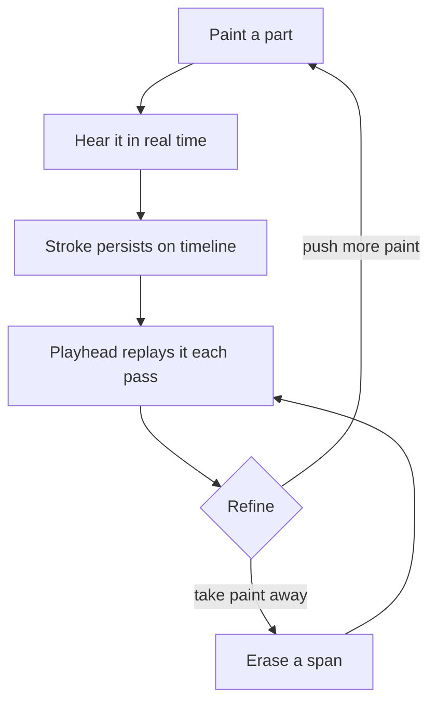
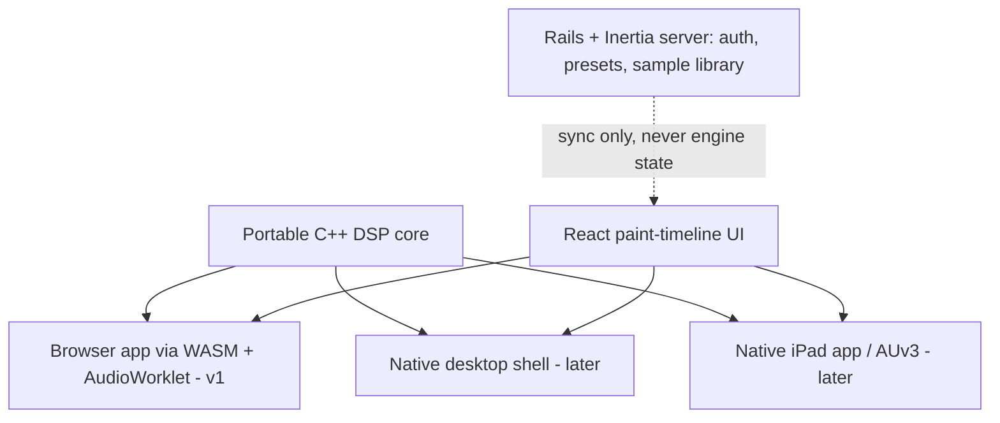
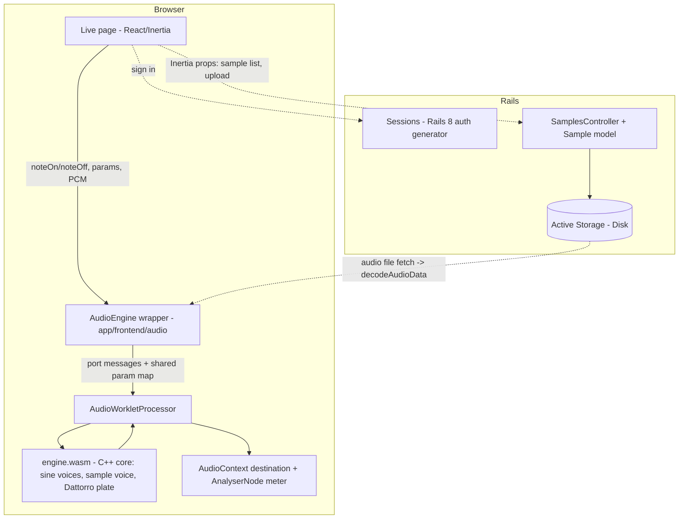

# Ambient Live - Plan

## Goal Capsule

- **Objective:** Build Ambient Live, a browser-based ambient music instrument-DAW whose core interaction is painting sound onto a slow-moving visual timeline.
- **This enrichment's scope (v0.1 playable slice):** a sine synth you can play, a Dattorro plate reverb the synth and samples run through, sample playback, server-side sample storage via Active Storage, and authentication. Advances R8, R10, R12, R13, R15, R16, R17, R18. Everything else in the Product Contract is deferred to follow-up enrichment (see Scope Boundaries).
- **Product authority:** Kieran Klaassen — sole user and product owner. Requirements settled in brainstorm dialogue (2026-07-21); tech direction cross-checked the same day by an independent research POV, which agreed with the direction and corrected the latency and iPad claims recorded below.
- **Stop conditions:** stop if the C++ core cannot compile to a working AudioWorklet with the local Emscripten toolchain, or if evidence invalidates a session-settled decision — report rather than substitute a different architecture.
- **Open blockers:** None.

---

## Product Contract

### Summary

Ambient Live is a personal, browser-based ambient music instrument-DAW: a fluid, slow-moving visual timeline the user paints sound onto — painting is playing — backed by built-in ambient-native devices (granular synth, sine synth, grain/echo delays, hall reverb), day-one live audio input, and a preset-and-sample library. It ships as a Rails + Inertia + React app whose portable C++/WASM audio engine stays cleanly separated from both the UI and the server.

### Problem Frame

The user makes ambient music in Ableton Live today. General-purpose DAWs are arrangement grids tuned for edit precision; ambient is made gesturally — slow textures, evolving washes, played drones — and the tools fight that pace. The want is an instrument-like environment where the interface itself is fluid, visual, and playback-centric rather than a track-and-clip editor.

The gap is the interaction model, not the device collection: pressed to name plugins that would be genuinely missed, the user named exactly one (a Valhalla reverb). This is a personal tool; it succeeds if the user keeps choosing to open it for real sessions.

### Key Decisions

- **Paint-as-performance is the capture and composition model.** Painting a part onto the timeline is playing it: the material sounds in real time under the brush, persists on the timeline, and replays on every playhead pass. Composing is pushing paint on and taking paint away — deliberately non-immediate, matching ambient's pace. There is no separate record-arm step and no piano-roll. (session-settled: user-directed — chosen over record-live-performance and sequence-then-bounce capture models: painting collapses performing and arranging into one gesture, which is the product's point.)

- **Full web app, not JUCE-native or a hybrid shell, for v1.** Iteration speed and the paint-canvas UI are the product, and every stroke is simultaneously a rendering event and an audio event — a workload that wants the UI and engine in one process, not across a C++/JS bridge. Ambient's latency tolerance makes browser audio acceptable (see the latency decision below). (session-settled: user-approved — chosen over JUCE + React WebView: web maximizes iteration speed and gesture-to-sound tightness; JUCE's advantages, VST hosting and low latency, were shown non-load-bearing for v1 by the user's own evidence.)
- **Rails + Inertia + React is the application chassis.** Rails carries auth, presets, and the sample library's server-side source of truth. Two conditions keep the chassis safe: Rails must serve the cross-origin isolation headers (COOP/COEP) the audio engine needs for WASM threads, and the instrument must boot without the Rails server — no Inertia-delivered state threads into the engine. (session-settled: user-approved — chosen over a serverless static SPA: the user prefers the Rails + Inertia stack, and the library needs a server-side source of truth anyway because Safari can evict browser storage after 7 days.)
- **The DSP core is portable C++ compiled to WASM, strictly separated from UI and server.** The same core later drops into a native shell without a rewrite — that separation is what keeps the escape hatch open. C++ over Rust is evidence-backed: Emscripten's Wasm Audio Worklets are stable while Rust's worklet backend requires nightly toolchains and its main plugin framework is in maintenance mode, and C++ ports cleanly to JUCE/AUv3 for the eventual iPad app. Faust (compiles to both WASM and native) is a candidate for authoring the hard DSP, the reverb first — toolchain choice is a planning decision (resolved for this slice in the Planning Contract: hand-written C++). (session-settled: user-approved — chosen over Rust core and over no-discipline TypeScript DSP: portability to the JUCE-shaped hatch is the requirement; C++ has the stablest path on both ends.)

- **VST/AU hosting is out of v1.** The user's evidence bar was one plugin (a Valhalla reverb), not a library — so hosting is deferred to a possible native shell, and in its place stands a quality requirement: the built-in reverb must be good enough that ValhallaVintageVerb is not missed. (session-settled: user-approved — chosen over day-one plugin hosting: hosting would force the native path and its iteration cost; the one load-bearing sound is buildable natively to the product.)
- **Live input is a day-one requirement — and v1's first risk probe.** Mic/guitar through the granulators and reverbs is part of the point. Measured web audio round-trip is ~39ms (Firefox) / ~50ms (Chrome) / ~100ms (Safari) on comparable hardware — fine for painting, drones, and swells; monitoring live guitar through the app is the one at-risk requirement, so a latency spike is built before anything else (see Success Criteria). (session-settled: user-directed — chosen over deferring live input: playing live sound through the instrument is core to the product's identity.) *This run's user directive defers live input out of the v0.1 slice — see the Planning Contract's deferral note.*
- **iPad is an eventual first-class native target; iPad-in-Safari is a demo surface only.** Safari's ~100ms round-trip, late and buggy Pencil event support, and episodic WebKit audio regressions demote the browser-on-iPad path to demos. The real iPad story rides the native hatch (JUCE/AUv3-shaped). (session-settled: user-directed — chosen over iPad-as-primary and iPad-as-bonus: a proper native iPad app is part of the long-term vision, which is also what tips the core language to C++.)

### Requirements

**Timeline and instrument**

- R1. Painting a part onto the timeline sounds in real time as it is painted.
- R2. Painted material persists on the timeline and replays whenever the playhead passes it.
- R3. Composition is additive and subtractive: material can be pushed onto and erased from the timeline.
- R4. The timeline is visual, non-traditional, and slow-moving, with loop and jump-back navigation.
- R5. A live-playable layer provides drones and scale-constrained playing surfaces.
- R6. Live audio input (mic or guitar) routes through the built-in devices in real time.

**Built-in devices**

- R7. A granular synthesis device.
- R8. A sine-based synthesis device.
- R9. Grain-delay and echo-style delay devices.
- R10. A Valhalla-class algorithmic hall reverb, good enough that the user does not miss ValhallaVintageVerb for ambient work.

**Sound library**

- R11. Factory presets and sounds, with audible preview before loading.
- R12. The user can import their own samples into the library.
- R13. The server is the library's source of truth; browser storage is a cache, and storage eviction must not lose user material.

**Output**

- R14. Compositions can be bounced/exported to an audio file.

**Chassis and engine boundary**

- R15. The app is a Rails + Inertia + React application, and Rails serves the cross-origin isolation headers (COOP/COEP) required for WASM threads.
- R16. The audio engine boots and runs without the Rails server; no Inertia-delivered state threads into the engine.
- R17. All DSP lives in the portable C++ core; no browser-only dependencies inside the core.

**Access**

- R18. The app requires authentication; only a signed-in user can reach the instrument and the sample library. (Added at plan enrichment — user-directed in the v0.1 slice request; the brainstorm's Summary already assigned auth to the Rails chassis.)

### Key Flows

- F1. Paint-compose
  - **Trigger:** User selects a device (e.g., granular synth) and paints onto the timeline.
  - **Steps:** Stroke sounds in real time; stroke persists as a painted part; playhead replays the part each pass; user pushes more paint or erases spans until the section feels right.
  - **Outcome:** A composed section exists on the timeline with no separate record step. **Covers R1, R2, R3, R4.**
- F2. Live-input jam
  - **Trigger:** User enables live input with a mic or guitar connected.
  - **Steps:** Input routes through a chosen device chain (granular, delays, reverb); user plays against the timeline and the drone/scale layer.
  - **Outcome:** Live sound is processed and audible with playable latency. **Covers R5, R6.**
- F3. Sample import and preview
  - **Trigger:** User opens the library to find source material for the granular engine.
  - **Steps:** User previews presets/sounds audibly without disturbing the working state; imports own samples; library syncs to the server.
  - **Outcome:** Material is available to devices and survives browser storage eviction. **Covers R11, R12, R13.**
- F4. Sign in and play (v0.1 slice)
  - **Trigger:** The owner opens the app.
  - **Steps:** Unauthenticated visits redirect to the login page; after sign-in, the live page loads; the user starts audio with one gesture, plays the sine synth through the reverb, uploads a sample, and plays it through the same reverb.
  - **Outcome:** A playable instrument behind auth, with samples persisted server-side. **Covers R8, R10, R12, R13, R18.**

### Acceptance Examples

- AE1. **Covers R1, R2.** Given an empty timeline, when the user paints a granular part across a region, then the part is audible while painting and audible again when the playhead crosses that region on the next pass.
- AE2. **Covers R3.** Given a painted region, when the user erases part of it, then the erased span is silent on subsequent passes while the remainder still plays.
- AE3. **Covers R6.** Given a connected mic or guitar, when the user enables live input, then the signal is audible through the selected device chain at a latency that feels playable for ambient material.
- AE4. **Covers R11.** Given the library browser is open, when the user previews a preset, then it is audible without replacing the current working state.
- AE5. **Covers R16.** Given the Rails server is stopped, when the built app is opened, then the instrument boots and produces sound, with library sync unavailable.
- AE6. **Covers R13.** Given browser storage was evicted, when the user reopens the app and signs in, then imported samples and presets are restored from the server.
- AE7. **Covers R8, R10.** Given the live page is loaded and audio started, when the user holds a key on the playing surface, then a sine tone sounds through the reverb, and releasing the key lets the tone fade with a reverb tail rather than cutting to silence.
- AE8. **Covers R12, R13, R18.** Given a signed-in user uploads an audio file, then it appears in their sample list, persists across a browser restart, and plays through the reverb on demand; a signed-out visitor can reach neither the page nor the upload endpoint.

### Success Criteria

- **Latency spike passes first.** Before any other feature is built, a spike proves live guitar → granulator → reverb monitoring feels playable on the dev machine in Chrome/Firefox (measured round-trip at or under ~50ms, judged by feel). If it fails, the live-monitoring requirement — not the product — moves behind the native hatch. *(Deferred out of the v0.1 slice by this run's user directive; remains the first criterion for the next slice.)*
- **Reverb parity.** In the user's own A/B against ValhallaVintageVerb on ambient material, the built-in reverb is not the reason to leave the app.
- **Iteration speed holds.** UI and device-tuning changes are visible in seconds throughout development; losing this would negate the reason the web stack was chosen.
- **The instrument gets used.** After v0.1, the user keeps opening it for real sessions instead of defaulting to Ableton for the same material.

### Scope Boundaries

**Deferred for later**

- VST/AU plugin hosting — revisit via a native shell if the built-ins prove insufficient.
- Native desktop shell (Tauri or JUCE + WebView) around the same core and UI.
- Native iPad app (JUCE/AUv3-shaped); iPad-in-Safari remains demo-only until then.
- Multi-channel audio interface routing — v1 assumes stereo in/out, one mic or guitar at a time.
- Preset and piece sharing, and any community features — the Rails chassis makes them cheap later.

**Outside this product's identity**

- A general-purpose DAW: beat/percussive workflows, clip grids, comprehensive mixing consoles.
- MIDI piano-roll editing — painting and playable surfaces are the control model.

### Deferred to Follow-Up Work

Product Contract requirements not implemented by this enrichment's units; each needs a follow-up enrichment pass before implementation:

- Live-input latency spike and live input routing (R6, AE3, F2) — deferred out of v0.1 by the user's slice directive; scheduled first for the next slice per Success Criteria.
- Paint timeline and paint-as-performance (R1-R4, F1, AE1, AE2).
- Granular synth, delays, drone/scale layer (R5, R7, R9).
- Factory presets with audible preview (R11, AE4); browser-side sample caching for offline/eviction resilience (the R13 cache half; server source of truth ships now).
- Bounce/export (R14).
- Serverless boot of the built app (AE5) — v0.1 keeps the engine free of server state (R16's boundary), but the page itself is still served by Rails; a static-build boot path is follow-up work.
- Password reset flow for auth — v0.1 is single-owner; password changes happen via Rails console.

### Dependencies / Assumptions

- Assumption (flagged for cheap correction): "no MIDI piano-roll" rests on a garbled voice transcription read as "I don't want to see MIDI"; if wrong, the control-surface story changes.
- Assumption: stereo I/O suffices for v1; the user records one source at a time.
- Assumption: desktop Chrome/Firefox are the primary v1 targets; Safari (desktop and iPad) is demo-grade.
- Engine constraints accepted as the cost of the web path: software flush-to-zero for denormals in WASM, allocation-free audio-worklet code, generous buffer sizes, and tolerance for episodic WebKit audio regressions. Same DSP math as native; different failure modes — all manageable for ambient.
- Local toolchain verified: Ruby 3.4.2, Rails 8.1.3, Node 22, Emscripten 6.0.3 (`emcc` on PATH; installed 2026-07-21). Faust is not installed.

### Sources / Research

- Independent tech POV (2026-07-21): agreed with web-first + portable C++ core + JUCE-shaped hatch; supplied measured round-trip latency (WAC 2025 MLS measurements: ~39ms Firefox / ~50ms Chrome / ~100ms Safari on a MacBook Pro) and the iPad-Safari demotion evidence (Pencil `getCoalescedEvents` only since iOS 18.2 with bugs; iPadOS 17.5 shipped an AudioWorklet distortion regression).
- JUCE 8 WebView UIs (juce.com, "JUCE 8 Feature Overview: WebView UIs") — React UIs over native C++ engines with parameter relays; keeps the native hatch credible for the same React UI.
- Rust audio status: `cpal` is current but its AudioWorklet backend requires nightly Rust; `nih-plug` is in maintenance mode — the basis for choosing C++ over Rust for the core.
- Emscripten Wasm Audio Worklets are stable — the C++-core-to-browser path.
- Faust compiles to both WASM/AudioWorklet and native/JUCE — candidate for write-once DSP authoring.
- Safari ITP 7-day storage eviction and iOS PWA storage caps — the basis for R13's server-side source of truth.
- Dattorro, "Effect Design Part 1: Reverberator and Other Filters" (JAES 1997, ccrma.stanford.edu/~dattorro/EffectDesignPart1.pdf) — the plate reverb topology KTD-2 pins: 4 series input allpasses, figure-8 cross-coupled tank with modulated allpasses, damping in the loop, multi-tap stereo outputs. Reference C implementation: github.com/el-visio/dattorro-verb (MIT).
- Chrome Developers, "Audio worklet design pattern" — the WASM-in-worklet loading patterns KTD-3 chooses between: sync-compile glue in the worklet scope vs. main-thread `WebAssembly.compileStreaming` + `Module` transfer via `processorOptions` + instantiate in the worklet constructor. An instantiated `WebAssembly.Instance` is not cloneable; only the compiled `Module` transfers.

---

## Planning Contract

**Product Contract preservation:** changed: added R18 (authentication made an explicit requirement — user-directed in this run's request), F4, AE7, AE8 (slice flows/examples); added `Deferred to Follow-Up Work` under Scope Boundaries; annotated the live-input Key Decision and latency-spike Success Criterion with this run's user-directed deferral (sequencing note only — the product decision stands); Outstanding Questions rewritten to current state (planning resolved the DSP-authoring question for this slice; the rest remain deferred). No existing R/F/AE text or IDs were altered.

### Key Technical Decisions

- KTD-1. **Hand-written C++ for the v0.1 DSP core; Faust stays a candidate for later devices.** The slice needs a sine voice, one reverb, and a sample player — small enough to hand-write against the Dattorro paper, and `faust` is not installed locally while `emcc` 6.0.3 is verified working. Faust remains flagged for the granular engine and future devices where write-once authoring pays. (Resolves the origin's "hand-written C++ vs Faust" question for this slice; instantiates the session-settled C++/WASM core decision — user-approved, chosen over Rust core and TypeScript-only DSP: portability to the native hatch.)
- KTD-2. **The reverb is a Dattorro (1997) plate: 4 series input allpasses → figure-8 cross-coupled tank with two modulated allpasses, in-loop damping, and multi-tap stereo outputs, plus pre-delay and wet/dry mix.** This is the reference topology for lush, non-metallic plate decay — the credible first swing at R10's "don't miss ValhallaVintageVerb" bar. Rejected: Freeverb (metallic transient ring), FDN hall (more tuning risk for a first slice), convolution (not algorithmic, no parametric decay). Exposed parameters for v0.1: mix, decay, damping, pre-delay. Final parity is judged by the user's A/B (Success Criteria), not by this plan.
- KTD-3. **WASM loads via main-thread `WebAssembly.compileStreaming` → transfer the compiled `Module` through `AudioWorkletNode` `processorOptions` → synchronous `WebAssembly.instantiate` in the worklet constructor.** No Emscripten JS glue inside the worklet; the C++ core exports a flat C ABI over a static heap. Rejected: Emscripten's sync-compile-in-worklet glue (couples the worklet to glue internals) and instantiating on the main thread (a `WebAssembly.Instance` cannot be structured-cloned).
- KTD-4. **The engine is single-threaded in v0.1 — no SharedArrayBuffer — but Rails serves COOP/COEP cross-origin isolation headers now.** Honors the session-settled headers decision (user-approved — chosen over skipping isolation headers: required for WASM threading later; cheap to add now) while the slice's DSP load stays trivially single-worklet. COEP uses `credentialless` so the Vite dev server's cross-port assets keep loading without CORP plumbing; Chrome/Firefox (the primary targets) support it, Safari is demo-grade per assumptions.
- KTD-5. **Auth is the Rails 8 built-in authentication generator (sessions + bcrypt), with the login view replaced by an Inertia page and no self-serve signup or password reset.** Single-owner personal app: the owner user is created via `db/seeds.rb`; resets happen in the console. Rejected: Devise (heavier, ERB-view-centric, nothing the slice needs beyond what the generator provides).
- KTD-6. **Samples are a `Sample` model with `has_one_attached :audio_file` on Active Storage's Disk service, decoded in the browser with `decodeAudioData`, and handed to the engine as raw PCM.** (Instantiates the session-settled server-side storage decision — user-directed, chosen over browser-local-only storage: Safari's 7-day eviction makes the server the reliable home.) Decoding stays on the main thread (browser-native, all formats); the engine receives Float32 PCM via the worklet port, keeping the C++ core free of codecs (R17). Playback runs inside the engine so samples pass through the same reverb as the synth.
- KTD-7. **The built `engine.wasm` artifact is committed to the repo; `script/build-engine` rebuilds it from `engine/` sources.** Keeps `bin/dev` and CI working without Emscripten installed; the artifact is small and rebuilt deliberately. Rejected: building WASM inside the Vite pipeline (adds emcc as a hard dev dependency and slows iteration).
- KTD-8. **Engine boundary discipline (R16, R17):** all engine TypeScript lives in `app/frontend/audio/` and imports nothing from Inertia, pages, or server-derived state; the C++ core in `engine/` includes no Emscripten/browser headers in DSP code. The audio thread is allocation-free in `process()`; denormals are flushed with a software threshold. Sample-load allocation happens in the worklet message handler between render quanta — an accepted v0.1 trade recorded in the unit.

### Deferral note (report-conflicts channel)

The origin plan's first success criterion orders the live-input latency spike before any other feature. The user's v0.1 slice request explicitly re-scoped this run to synth + reverb + samples + storage + auth and directed that live input not be re-added. This is a user-directed sequencing override, not an invalidated decision; the spike remains first in line for the next enrichment.

### High-Level Technical Design

Signal flow inside the core: `sine voices + sample voice → sum → Dattorro plate (mix/decay/damping/pre-delay) → stereo out`. The Rails side never touches engine state — it only serves the page, auth, and sample bytes (KTD-8).

### Sequencing

U1 (auth) and U2 (headers) are independent of the audio stack. U3 (C++ core) → U4 (worklet + wrapper) → U6 (page) is the audio dependency chain. U5 (samples) needs U1. U6 integrates everything.

---

## Implementation Units

### U1. Authentication foundation

- **Goal:** All routes require a signed-in user; the owner signs in through an Inertia login page.
- **Requirements:** R18, F4, AE8 (auth half).
- **Dependencies:** none.
- **Files:** `Gemfile` (bcrypt), generator output (`app/models/user.rb`, `app/models/session.rb`, `app/models/current.rb`, `app/controllers/concerns/authentication.rb`, `app/controllers/sessions_controller.rb`, migrations), `app/controllers/application_controller.rb`, `app/frontend/pages/auth/login.tsx`, `config/routes.rb`, `db/seeds.rb`, `test/controllers/sessions_controller_test.rb`, `test/fixtures/users.yml`.
- **Approach:** Run `bin/rails generate authentication`, then adapt: `SessionsController#new` renders the Inertia `auth/login` page instead of the ERB view; delete the generated ERB session/password views, passwords controller, mailer, and reset routes (KTD-5 — no reset flow in v0.1). Seed the owner user with env-overridable email/password. Login errors surface through Inertia's validation-error flow.
- **Patterns to follow:** `InertiaController` for shared-data conventions; the Rails 8 generator's `Authentication` concern stays as generated (rate limiting, `Current.session`).
- **Test scenarios:**
  - Happy path: valid credentials sign in and redirect to root; the session persists across requests.
  - Error path: wrong password re-renders login with an error and no session.
  - Gating: unauthenticated GET to root redirects to the login page; authenticated GET renders. Covers AE8 (signed-out visitor reaches neither page nor endpoint — endpoint half asserted in U5).
  - Sign out destroys the session and subsequent requests redirect to login.
- **Verification:** `bin/rails test` green; manual sign-in through the browser works via `bin/dev`.

### U2. Cross-origin isolation headers

- **Goal:** Every Rails HTML response carries `Cross-Origin-Opener-Policy: same-origin` and `Cross-Origin-Embedder-Policy: credentialless`, and the Vite-served dev assets still load (KTD-4, R15).
- **Requirements:** R15.
- **Dependencies:** none.
- **Files:** `config/initializers/cross_origin_isolation.rb` (or equivalent middleware/controller hook), `vite.config.ts` (dev-server response headers if needed), `test/integration/isolation_headers_test.rb`.
- **Approach:** Set the two headers app-wide from one place. Verify in dev that `window.crossOriginIsolated` is `true` and Vite HMR assets load; if `credentialless` blocks any dev asset, add the matching CORS/CORP header on the Vite dev server rather than weakening the Rails headers.
- **Test scenarios:**
  - Integration test: GET root (signed in) responds with both headers with exact values.
  - Integration test: the login page response also carries both headers (unauthenticated path).
- **Verification:** tests green; in the running dev app, `crossOriginIsolated === true` in the console and no blocked-resource errors.

### U3. C++ DSP core (sine + sample voice + Dattorro plate) compiled to WASM

- **Goal:** A portable C++ core that synthesizes sine notes, plays a loaded PCM sample, and runs both through a Dattorro plate reverb — compiled to a committed `engine.wasm`, provable natively.
- **Requirements:** R8, R10, R17; KTD-1, KTD-2, KTD-7, KTD-8. AE7 (DSP half).
- **Dependencies:** none.
- **Files:** `engine/src/engine.h`, `engine/src/engine.cpp` (voice management + mixing), `engine/src/sine_voice.h`, `engine/src/sample_voice.h`, `engine/src/dattorro_reverb.h`, `engine/src/dattorro_reverb.cpp`, `engine/src/api.cpp` (C ABI), `engine/test/engine_test.cpp`, `script/build-engine`, `script/test-engine`, `app/frontend/audio/engine.wasm` (committed artifact), `engine/README.md` (update: implemented surface + build/test commands).
- **Approach:** C ABI over a static heap — no malloc in the signal path: `engine_init(sample_rate)`, `engine_note_on(note_id, freq, gain)`, `engine_note_off(note_id)`, `engine_set_param(param_id, value)` (reverb mix/decay/damping/pre-delay, master gain), `engine_sample_buffer(max_frames) -> float*` + `engine_sample_loaded(frames, channels)`, `engine_sample_play()/stop()`, `engine_process(out_l_ptr, out_r_ptr, frames)`. Sine voices get a short attack/release envelope so releases decay into the reverb tail (AE7). Reverb per KTD-2 with Dattorro's published delay lengths scaled to the context sample rate. Flush denormals via a magnitude threshold in feedback paths (KTD-8). Fixed voice pool (e.g., 8) and a fixed max sample length (e.g., 60s stereo at 48kHz) — static allocation only. Build with `emcc -O3 --no-entry` exporting the C ABI to a standalone-instantiable `.wasm` (no JS glue, per KTD-3); `script/build-engine` writes `app/frontend/audio/engine.wasm`.
- **Execution note:** Prove the DSP natively first — `script/test-engine` compiles `engine/test/engine_test.cpp` with the system clang++ and runs it; the WASM build is a packaging step after the native tests pass.
- **Test scenarios (native harness, `engine/test/engine_test.cpp`):**
  - Sine: after `note_on(440)`, output is non-silent and zero-crossing rate over 1s approximates 440Hz ±2%; after `note_off` plus release+tail, dry-path output (mix=0) returns to silence.
  - Envelope: first samples after `note_on` ramp from zero (no click-step to full amplitude).
  - Reverb tail: with mix=1, a single-sample impulse produces energy 0.5s later (tail exists), and RMS at 3s < RMS at 0.5s (decays). Covers AE7's tail behavior.
  - Decay parameter: tail RMS at 2s with decay=0.9 exceeds tail RMS at 2s with decay=0.3.
  - Stability: 30s of processing with notes and impulses produces no NaN/inf and no sample exceeding ±4.0.
  - Denormal guard: after 10s of silence following a tail, feedback state magnitudes are exactly 0 or above the denormal threshold.
  - Sample voice: loaded ramp PCM plays back matching source values at mix=0 and stops at end-of-buffer.
- **Verification:** `script/test-engine` exits 0; `script/build-engine` produces `app/frontend/audio/engine.wasm` with the exported ABI (verify exports exist in the artifact).

### U4. AudioWorklet + TypeScript engine wrapper

- **Goal:** The browser boots the WASM core inside an AudioWorklet and exposes a typed `AudioEngine` API to the UI, with no server or Inertia dependency (R16, KTD-8).
- **Requirements:** R16, R17 boundary; KTD-3, KTD-8. AE7 (wiring half).
- **Dependencies:** U3.
- **Files:** `app/frontend/audio/engine-processor.ts` (worklet processor), `app/frontend/audio/audio-engine.ts` (main-thread wrapper), `app/frontend/audio/messages.ts` (port message types), `tsconfig.app.json` (worklet lib types if needed).
- **Approach:** Per KTD-3: the wrapper fetches `engine.wasm` (Vite `?url` import), `compileStreaming`s it, and constructs the `AudioWorkletNode` with the `Module` in `processorOptions`; the processor instantiates synchronously in its constructor and calls the C ABI. `process()` copies the core's static output buffers to the worklet outputs — no allocation, no locks. Port messages: `note-on`, `note-off`, `set-param`, `load-sample` (transfers a `Float32Array` copied into the WASM heap in the message handler — the KTD-8 accepted trade: allocation between render quanta, never inside `process()`), `play-sample`, `stop-sample`. The wrapper owns the `AudioContext`, resumes it on a user gesture, attaches an `AnalyserNode` for the UI meter, and exposes `decodeAndLoadSample(arrayBuffer)` using `decodeAudioData` (KTD-6).
- **Patterns to follow:** engine boundary rules in `engine/README.md`; no imports from `app/frontend/pages/` or Inertia.
- **Test scenarios:** Test expectation: browser-API-bound glue with no JS test harness in the repo — verified by `npm run check` (types) plus the U6 browser smoke gates (meter shows signal; console clean). The DSP logic itself is covered natively in U3.
- **Verification:** `npm run check` green; in the browser, engine boots after one gesture and produces sound with no console errors.

### U5. Sample storage (Active Storage)

- **Goal:** A signed-in user uploads audio files that persist server-side and lists/deletes them; the page receives the list as Inertia props (R12, R13 server half).
- **Requirements:** R12, R13, R18 gating; KTD-6. AE8.
- **Dependencies:** U1.
- **Files:** migration (`samples` table), `app/models/sample.rb`, `app/models/user.rb` (has_many), `app/controllers/samples_controller.rb`, `config/routes.rb`, `test/models/sample_test.rb`, `test/controllers/samples_controller_test.rb`, `test/fixtures/files/` (small wav fixture).
- **Approach:** `Sample(user:references, name:string)` with `has_one_attached :audio_file`; validate attachment presence, audio content type (wav/mp3/m4a/flac/ogg/aiff), and size cap (50MB). `create` derives name from filename when blank; `destroy` purges the attachment. Routes: `resources :samples, only: [:create, :destroy]` under auth; the live page's controller supplies `samples` props (id, name, url via `rails_blob_path`). Uploads go through Inertia's multipart form post; responses redirect back so Inertia refreshes props.
- **Test scenarios:**
  - Model: valid wav attachment is valid; missing attachment invalid; a text/plain attachment invalid; >50MB invalid (stubbed byte_size); blank name derived from filename.
  - Controller happy path: signed-in multipart POST creates a sample owned by the user and redirects; the file is attached.
  - Controller error path: invalid content type re-renders with errors and creates nothing.
  - Gating: unauthenticated POST /samples and DELETE /samples/:id redirect to login and change nothing (AE8).
  - Ownership: a user cannot destroy another user's sample.
  - Destroy purges the blob.
- **Verification:** `bin/rails test` green; uploaded file appears in `storage/` and is served at its blob URL.

### U6. Live page: playable surface, reverb controls, sample player

- **Goal:** The signed-in root page is the minimal instrument: start-audio gesture, playable sine keys, reverb controls, output meter, and the sample library with upload/play/delete — everything audible through the reverb (F4, AE7, AE8).
- **Requirements:** R8, R10, R12, R15 page-level, R18; F4, AE7, AE8.
- **Dependencies:** U1, U3, U4, U5.
- **Files:** `app/controllers/live_controller.rb`, `config/routes.rb` (root to live#index; remove inertia_example), delete `app/controllers/inertia_example_controller.rb` + `app/frontend/pages/inertia_example/`, `app/frontend/pages/live/index.tsx`, supporting components under `app/frontend/pages/live/`, `test/controllers/live_controller_test.rb`.
- **Approach:** One Inertia page owning an `AudioEngine` instance. Before the start gesture: a single "start audio" control (AudioContext resume policy). After boot: a one-octave-plus playing surface (pointer + computer-keyboard events, ambient-tuned default octave) driving `noteOn/noteOff`; sliders for reverb mix/decay/damping/pre-delay and master gain; an output level meter from the wrapper's analyser (the browser-testable "sound is happening" signal); the sample list with per-sample play/stop (fetch blob URL → `decodeAndLoadSample` → play through the engine) and an upload form (Inertia `useForm`, multipart). Engine state never comes from props (KTD-8); props carry only the sample list. Keep the UI dark, calm, minimal — a playable page, not the paint timeline.
- **Patterns to follow:** existing Inertia page structure (`app/frontend/pages/inertia_example/index.tsx`) for page-module conventions; Tailwind for styling.
- **Test scenarios:**
  - Controller: signed-in GET root renders the live page with the user's samples as props, newest first; unauthenticated GET redirects to login.
  - Browser smoke (executed at the pipeline's browser-test step): sign in → start audio → hold a key → meter rises above zero and no console errors (AE7 proxy); upload a small wav → it appears in the list; play it → meter rises; delete removes it (AE8).
- **Verification:** `bin/rails test` and `npm run check` green; browser smoke gates pass.

---

## Verification Contract

| Gate | Command | Proves |
|---|---|---|
| Rails suite | `bin/rails test` | Auth gating, headers, sample CRUD/validation, live page props |
| Type check | `npm run check` | Frontend + worklet TypeScript integrity |
| Native DSP tests | `script/test-engine` | Sine pitch/envelope, reverb tail/decay/stability, denormal guard, sample voice (U3 scenarios) |
| Engine build | `script/build-engine` | `engine/` sources compile to `app/frontend/audio/engine.wasm` with the expected exports |
| Browser smoke | via browser-test step against `bin/dev` | Sign-in → play → meter signal; upload → play → delete; `crossOriginIsolated === true`; clean console |

All five gates must pass before the slice is done. The reverb-parity success criterion (user's own A/B) is explicitly outside automated verification.

## Definition of Done

- All six units implemented and their per-unit verifications pass; the five Verification Contract gates are green.
- A signed-in user can: play sine notes through the reverb with audible tails, adjust reverb parameters audibly, upload a sample that persists server-side, play it through the same reverb, and delete it. A signed-out visitor can do none of this.
- Engine boundary holds: `app/frontend/audio/` has no Inertia/pages imports; `engine/` has no browser/Emscripten includes in DSP code; `engine.wasm` is committed and reproducible via `script/build-engine`.
- COOP/COEP headers ship on all HTML responses and dev-mode `crossOriginIsolated` is true.
- The `inertia_example` scaffold is removed; no dead or abandoned-attempt code remains in the diff.
- Deferred scope (live input first among it) is recorded in Scope Boundaries — nothing beyond the slice was built.

## Outstanding Questions

**Deferred to follow-up enrichment (non-blocking for this slice)**

- Paint semantics: what a stroke controls (pitch, grain density, intensity), lanes versus freeform canvas, brush vocabulary — a strong candidate for a visual sketch session before building.
- Export/render path: offline render versus real-time bounce, and formats.
- Library sync model: browser-side caching and offline behavior (server source of truth ships in this slice); upload flow for very large samples.
- Routing: whether painted parts and the live-playable layer share one device chain or have independent routing.
- DSP authoring for the granular engine and delays: hand-written C++ versus Faust (resolved as hand-written for this slice's reverb — KTD-1; re-evaluate when the granular engine is planned).
