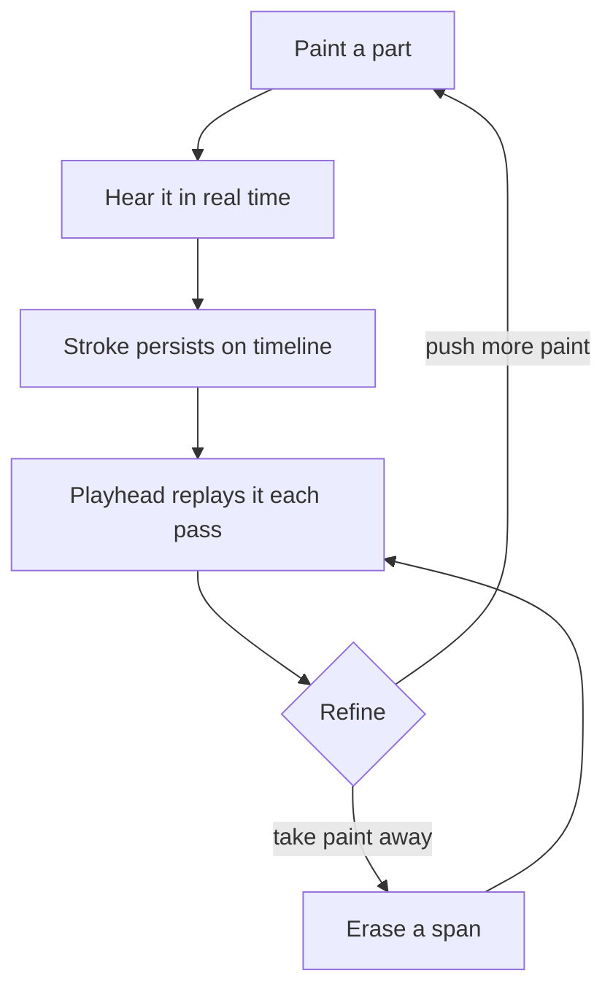
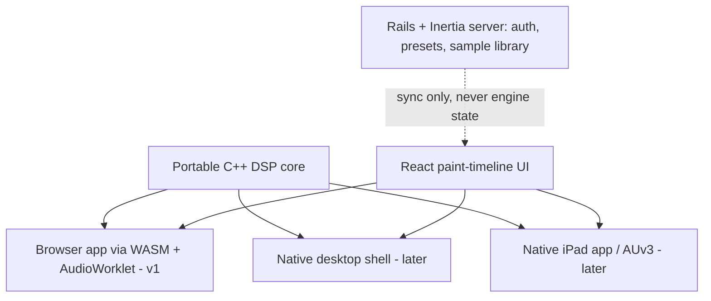

# Ambient Live - Plan

## Goal Capsule

- **Objective:** Build Ambient Live, a browser-based ambient music instrument-DAW whose core interaction is painting sound onto a slow-moving visual timeline.
- **Product authority:** Kieran Klaassen — sole user and product owner. Requirements settled in brainstorm dialogue (2026-07-21); tech direction cross-checked the same day by an independent research POV, which agreed with the direction and corrected the latency and iPad claims recorded below.
- **Open blockers:** None. All outstanding questions are deferred to planning.

---

## Product Contract

### Summary

Ambient Live is a personal, browser-based ambient music instrument-DAW: a fluid, slow-moving visual timeline the user paints sound onto — painting is playing — backed by built-in ambient-native devices (granular synth, sine synth, grain/echo delays, hall reverb), day-one live audio input, and a preset-and-sample library. It ships as a Rails + Inertia + React app whose portable C++/WASM audio engine stays cleanly separated from both the UI and the server.

### Problem Frame

The user makes ambient music in Ableton Live today. General-purpose DAWs are arrangement grids tuned for edit precision; ambient is made gesturally — slow textures, evolving washes, played drones — and the tools fight that pace. The want is an instrument-like environment where the interface itself is fluid, visual, and playback-centric rather than a track-and-clip editor.

The gap is the interaction model, not the device collection: pressed to name plugins that would be genuinely missed, the user named exactly one (a Valhalla reverb). This is a personal tool; it succeeds if the user keeps choosing to open it for real sessions.

### Key Decisions

- **Paint-as-performance is the capture and composition model.** Painting a part onto the timeline is playing it: the material sounds in real time under the brush, persists on the timeline, and replays on every playhead pass. Composing is pushing paint on and taking paint away — deliberately non-immediate, matching ambient's pace. There is no separate record-arm step and no piano-roll. (session-settled: user-directed — chosen over record-live-performance and sequence-then-bounce capture models: painting collapses performing and arranging into one gesture, which is the product's point.)

- **Full web app, not JUCE-native or a hybrid shell, for v1.** Iteration speed and the paint-canvas UI are the product, and every stroke is simultaneously a rendering event and an audio event — a workload that wants the UI and engine in one process, not across a C++/JS bridge. Ambient's latency tolerance makes browser audio acceptable (see the latency decision below). (session-settled: user-approved — chosen over JUCE + React WebView: web maximizes iteration speed and gesture-to-sound tightness; JUCE's advantages, VST hosting and low latency, were shown non-load-bearing for v1 by the user's own evidence.)
- **Rails + Inertia + React is the application chassis.** Rails carries auth, presets, and the sample library's server-side source of truth. Two conditions keep the chassis safe: Rails must serve the cross-origin isolation headers (COOP/COEP) the audio engine needs for WASM threads, and the instrument must boot without the Rails server — no Inertia-delivered state threads into the engine. (session-settled: user-approved — chosen over a serverless static SPA: the user prefers the Rails + Inertia stack, and the library needs a server-side source of truth anyway because Safari can evict browser storage after 7 days.)
- **The DSP core is portable C++ compiled to WASM, strictly separated from UI and server.** The same core later drops into a native shell without a rewrite — that separation is what keeps the escape hatch open. C++ over Rust is evidence-backed: Emscripten's Wasm Audio Worklets are stable while Rust's worklet backend requires nightly toolchains and its main plugin framework is in maintenance mode, and C++ ports cleanly to JUCE/AUv3 for the eventual iPad app. Faust (compiles to both WASM and native) is a candidate for authoring the hard DSP, the reverb first — toolchain choice is a planning decision. (session-settled: user-approved — chosen over Rust core and over no-discipline TypeScript DSP: portability to the JUCE-shaped hatch is the requirement; C++ has the stablest path on both ends.)

- **VST/AU hosting is out of v1.** The user's evidence bar was one plugin (a Valhalla reverb), not a library — so hosting is deferred to a possible native shell, and in its place stands a quality requirement: the built-in reverb must be good enough that ValhallaVintageVerb is not missed. (session-settled: user-approved — chosen over day-one plugin hosting: hosting would force the native path and its iteration cost; the one load-bearing sound is buildable natively to the product.)
- **Live input is a day-one requirement — and v1's first risk probe.** Mic/guitar through the granulators and reverbs is part of the point. Measured web audio round-trip is ~39ms (Firefox) / ~50ms (Chrome) / ~100ms (Safari) on comparable hardware — fine for painting, drones, and swells; monitoring live guitar through the app is the one at-risk requirement, so a latency spike is built before anything else (see Success Criteria). (session-settled: user-directed — chosen over deferring live input: playing live sound through the instrument is core to the product's identity.)
- **iPad is an eventual first-class native target; iPad-in-Safari is a demo surface only.** Safari's ~100ms round-trip, late and buggy Pencil event support, and episodic WebKit audio regressions demote the browser-on-iPad path to demos. The real iPad story rides the native hatch (JUCE/AUv3-shaped). (session-settled: user-directed — chosen over iPad-as-primary and iPad-as-bonus: a proper native iPad app is part of the long-term vision, which is also what tips the core language to C++.)

### Requirements

**Timeline and instrument**

- R1. Painting a part onto the timeline sounds in real time as it is painted.
- R2. Painted material persists on the timeline and replays whenever the playhead passes it.
- R3. Composition is additive and subtractive: material can be pushed onto and erased from the timeline.
- R4. The timeline is visual, non-traditional, and slow-moving, with loop and jump-back navigation.
- R5. A live-playable layer provides drones and scale-constrained playing surfaces.
- R6. Live audio input (mic or guitar) routes through the built-in devices in real time.

**Built-in devices**

- R7. A granular synthesis device.
- R8. A sine-based synthesis device.
- R9. Grain-delay and echo-style delay devices.
- R10. A Valhalla-class algorithmic hall reverb, good enough that the user does not miss ValhallaVintageVerb for ambient work.

**Sound library**

- R11. Factory presets and sounds, with audible preview before loading.
- R12. The user can import their own samples into the library.
- R13. The server is the library's source of truth; browser storage is a cache, and storage eviction must not lose user material.

**Output**

- R14. Compositions can be bounced/exported to an audio file.

**Chassis and engine boundary**

- R15. The app is a Rails + Inertia + React application, and Rails serves the cross-origin isolation headers (COOP/COEP) required for WASM threads.
- R16. The audio engine boots and runs without the Rails server; no Inertia-delivered state threads into the engine.
- R17. All DSP lives in the portable C++ core; no browser-only dependencies inside the core.

### Key Flows

- F1. Paint-compose
  - **Trigger:** User selects a device (e.g., granular synth) and paints onto the timeline.
  - **Steps:** Stroke sounds in real time; stroke persists as a painted part; playhead replays the part each pass; user pushes more paint or erases spans until the section feels right.
  - **Outcome:** A composed section exists on the timeline with no separate record step. **Covers R1, R2, R3, R4.**
- F2. Live-input jam
  - **Trigger:** User enables live input with a mic or guitar connected.
  - **Steps:** Input routes through a chosen device chain (granular, delays, reverb); user plays against the timeline and the drone/scale layer.
  - **Outcome:** Live sound is processed and audible with playable latency. **Covers R5, R6.**
- F3. Sample import and preview
  - **Trigger:** User opens the library to find source material for the granular engine.
  - **Steps:** User previews presets/sounds audibly without disturbing the working state; imports own samples; library syncs to the server.
  - **Outcome:** Material is available to devices and survives browser storage eviction. **Covers R11, R12, R13.**

### Acceptance Examples

- AE1. **Covers R1, R2.** Given an empty timeline, when the user paints a granular part across a region, then the part is audible while painting and audible again when the playhead crosses that region on the next pass.
- AE2. **Covers R3.** Given a painted region, when the user erases part of it, then the erased span is silent on subsequent passes while the remainder still plays.
- AE3. **Covers R6.** Given a connected mic or guitar, when the user enables live input, then the signal is audible through the selected device chain at a latency that feels playable for ambient material.
- AE4. **Covers R11.** Given the library browser is open, when the user previews a preset, then it is audible without replacing the current working state.
- AE5. **Covers R16.** Given the Rails server is stopped, when the built app is opened, then the instrument boots and produces sound, with library sync unavailable.
- AE6. **Covers R13.** Given browser storage was evicted, when the user reopens the app and signs in, then imported samples and presets are restored from the server.

### Success Criteria

- **Latency spike passes first.** Before any other feature is built, a spike proves live guitar → granulator → reverb monitoring feels playable on the dev machine in Chrome/Firefox (measured round-trip at or under ~50ms, judged by feel). If it fails, the live-monitoring requirement — not the product — moves behind the native hatch.
- **Reverb parity.** In the user's own A/B against ValhallaVintageVerb on ambient material, the built-in reverb is not the reason to leave the app.
- **Iteration speed holds.** UI and device-tuning changes are visible in seconds throughout development; losing this would negate the reason the web stack was chosen.
- **The instrument gets used.** After v0.1, the user keeps opening it for real sessions instead of defaulting to Ableton for the same material.

### Scope Boundaries

**Deferred for later**

- VST/AU plugin hosting — revisit via a native shell if the built-ins prove insufficient.
- Native desktop shell (Tauri or JUCE + WebView) around the same core and UI.
- Native iPad app (JUCE/AUv3-shaped); iPad-in-Safari remains demo-only until then.
- Multi-channel audio interface routing — v1 assumes stereo in/out, one mic or guitar at a time.
- Preset and piece sharing, and any community features — the Rails chassis makes them cheap later.

**Outside this product's identity**

- A general-purpose DAW: beat/percussive workflows, clip grids, comprehensive mixing consoles.
- MIDI piano-roll editing — painting and playable surfaces are the control model.

### Dependencies / Assumptions

- Assumption (flagged for cheap correction): "no MIDI piano-roll" rests on a garbled voice transcription read as "I don't want to see MIDI"; if wrong, the control-surface story changes.
- Assumption: stereo I/O suffices for v1; the user records one source at a time.
- Assumption: desktop Chrome/Firefox are the primary v1 targets; Safari (desktop and iPad) is demo-grade.
- Engine constraints accepted as the cost of the web path: software flush-to-zero for denormals in WASM, allocation-free audio-worklet code, generous buffer sizes, and tolerance for episodic WebKit audio regressions. Same DSP math as native; different failure modes — all manageable for ambient.
- Local toolchain verified: Ruby 3.4.2, Rails 8.1.3, Node 22.

### Outstanding Questions

**Deferred to Planning**

- Core DSP authoring: hand-written C++ versus Faust for the hard devices (reverb first).
- Paint semantics: what a stroke controls (pitch, grain density, intensity), lanes versus freeform canvas, brush vocabulary — a strong candidate for a visual sketch session before building.
- Export/render path: offline render versus real-time bounce, and formats.
- Library sync model: cache invalidation, offline behavior, upload flow for large samples.
- Routing: whether painted parts and the live-playable layer share one device chain or have independent routing.

### Sources / Research

- Independent tech POV (2026-07-21): agreed with web-first + portable C++ core + JUCE-shaped hatch; supplied measured round-trip latency (WAC 2025 MLS measurements: ~39ms Firefox / ~50ms Chrome / ~100ms Safari on a MacBook Pro) and the iPad-Safari demotion evidence (Pencil `getCoalescedEvents` only since iOS 18.2 with bugs; iPadOS 17.5 shipped an AudioWorklet distortion regression).
- JUCE 8 WebView UIs (juce.com, "JUCE 8 Feature Overview: WebView UIs") — React UIs over native C++ engines with parameter relays; keeps the native hatch credible for the same React UI.
- Rust audio status: `cpal` is current but its AudioWorklet backend requires nightly Rust; `nih-plug` is in maintenance mode — the basis for choosing C++ over Rust for the core.
- Emscripten Wasm Audio Worklets are stable — the C++-core-to-browser path.
- Faust compiles to both WASM/AudioWorklet and native/JUCE — candidate for write-once DSP authoring.
- Safari ITP 7-day storage eviction and iOS PWA storage caps — the basis for R13's server-side source of truth.
