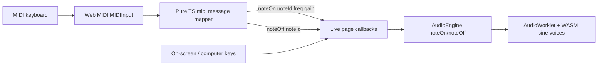

# feat: MIDI keyboard input for live sine synth

## Goal Capsule

- **Objective:** Let the user play the existing sine synth from an external MIDI keyboard via the Web MIDI API, routing note on/off (and cheap velocity) through the current AudioWorklet/WASM engine without expanding into paint-timeline, live audio input, or VST hosting.
- **Product authority:** Kieran Klaassen — sole user and product owner. Architecture constraints carry from Ambient Live v0.1 (`docs/plans/2026-07-21-001-feat-ambient-live-plan.md`) and the LFG settled-decisions brief for this run.
- **Stop conditions:** stop if Web MIDI is unavailable in the target browsers with no workable secure-context path, or if evidence invalidates a session-settled decision — report rather than substitute a different architecture.
- **Open blockers:** None.

---

## Product Contract

### Summary

Ambient Live already offers a playable 13-key sine synth on the live page (pointer + computer keyboard) through a portable C++ WASM engine in an AudioWorklet. This slice adds hardware MIDI keyboard input so note on/off from a connected controller drives the same synth voices, with a small device-selection UX and velocity mapped to voice gain when present.

### Problem Frame

The on-screen and computer keyboards are enough to prove the engine, but real ambient sessions want a physical MIDI controller. The browser exposes devices through Web MIDI; the app has no MIDI path today. The gap is input plumbing and permission/device UX — not DSP.

### Requirements

- R1. After audio has started, the user can request MIDI access and choose an input device (or see a clear unavailable/denied state).
- R2. Note-on messages from the selected device start a sine voice for that MIDI note number through the existing engine path.
- R3. Note-off messages (and note-on with velocity 0) stop that voice through the existing engine path.
- R4. Velocity, when present on note-on, maps to voice gain with a simple linear scale; pointer/computer keyboard behavior remains unchanged when MIDI is idle.
- R5. MIDI note events drive the sine synth only — not sample playback.
- R6. MIDI connection and teardown do not leave dangling `midimessage` listeners or stuck voices when the device disconnects, the selection changes, or the page unmounts.

### Scope Boundaries

**In scope**

- Web MIDI access, input enumeration, device picker, note on/off → `AudioEngine.noteOn` / `noteOff`
- Shared MIDI-note → frequency helper (extract/reuse from the on-screen keyboard)
- Minimal permission and unsupported-browser messaging
- Pure-TS unit coverage for MIDI message → note events; typecheck gate

**Out of scope**

- Paint timeline, live audio input, VST/AU hosting
- MIDI → sample triggering
- Sustain pedal, CC, pitch bend, aftertouch, program change, SysEx
- MIDI output / MIDI clock / MPE
- Changing the 8-voice engine pool size
- Auto-reconnect persistence across sessions (may land later)

### Deferred to Follow-Up Work

- Remember last-selected MIDI device id in local storage
- Optional visual highlight of on-screen keys when MIDI notes fire
- Sustain pedal (CC64) if it becomes load-bearing in real sessions

### Success Criteria

- With a MIDI keyboard connected in a supporting browser (Chromium/Edge; Firefox where Web MIDI is available), after Start audio + Connect MIDI + device selection, pressing keys produces sine notes through the reverb path.
- Releasing keys (or note-on velocity 0) releases voices cleanly.
- Denying MIDI permission or lacking Web MIDI leaves the pointer/computer keyboard path working.
- `npm run check` passes; new MIDI mapping unit tests pass.

### Key Decisions (product)

- MIDI maps only to the sine synth for this slice — not samples. (assumption — open area closed for tight scope)
- Device picker over silent auto-connect of the first/last device. (assumption — clearer permission UX; last-device memory deferred)
- Sustain/CC deferred unless trivial later. (assumption — YAGNI)

### Actors

- A1. Solo musician using Ambient Live in a desktop browser with an optional USB/Bluetooth MIDI keyboard.

### Key Flows

- F1. Start audio → Connect MIDI → grant permission → select input → play/release notes on the hardware keyboard → hear sine + reverb.
- F2. Deny MIDI permission or unsupported browser → see a short status message → continue with on-screen/computer keys.

### Acceptance Examples

- AE1. MIDI note 60 note-on with velocity 100 starts a voice at C4 frequency with gain derived from velocity; matching note-off stops it.
- AE2. Note-on with velocity 0 is treated as note-off.
- AE3. Switching the selected input detaches the previous port’s listener before attaching the new one.
- AE4. Unmounting the live page (or closing the engine) removes MIDI listeners and does not throw.

---

## Planning Contract

### Assumptions

- Target browsers for this slice are desktop Chromium-family first; Safari Web MIDI support may be absent — surface “MIDI not available” rather than polyfilling.
- Secure context is already required for the SharedArrayBuffer / COOP-COEP audio path; Web MIDI’s secure-context requirement is already satisfied in the app’s intended deploy shape.
- Velocity → gain uses a simple linear map into a comfortable gain band (e.g. scale into roughly the same order of magnitude as the current hardcoded `0.4` for mid velocities); no velocity curves.
- MIDI note number is used as `noteId` so hardware and on-screen keys share voice identity for overlapping notes.
- No frontend unit-test runner exists today (`package.json` only has `tsc`); this plan adds a minimal Vitest (or equivalent) harness only as needed for the pure MIDI parser/mapper — not a full browser MIDI mock suite.
- Web MIDI TypeScript types come from the project's DOM lib when available; otherwise add minimal local interfaces for `MIDIAccess` / `MIDIInput` / `MIDIMessageEvent` rather than a heavy dependency.

### Key Technical Decisions

- KTD1. Stay on the web-first Rails + Inertia + React chassis; do not introduce a native/JUCE shell for MIDI. (session-settled: user-directed — chosen over JUCE-native app: iteration speed and preferred stack)
- KTD2. Keep the audio engine free of Rails/Inertia props; MIDI state lives entirely in the frontend beside the live page. (session-settled: user-approved — chosen over coupling engine state to Inertia: keeps the native escape hatch open)
- KTD3. Route MIDI notes through the existing portable C++ WASM AudioWorklet path via `AudioEngine.noteOn` / `noteOff`; no new DSP for this slice. (session-settled: user-approved — chosen over TypeScript-only DSP: portability / quality path already chosen for the engine)
- KTD4. Do not expand this run into VST hosting or live audio input. (session-settled: user-directed — chosen over expanding scope: user scoped this run to MIDI keyboard support only)
- KTD5. Integrate MIDI in TypeScript only — parse Web MIDI bytes in a small pure module, then call the existing engine wrappers. Rejected alternative: C++ MIDI parsing inside WASM. Reason: velocity/gain and note id already work at the TS→worklet boundary; engine changes would only be needed for voice-count or DSP curves.
- KTD6. Gate MIDI permission behind an explicit Connect MIDI control that is enabled only after Start audio, then show a device `<select>` of `MIDIAccess.inputs`. Rejected alternative: auto-`requestMIDIAccess` on page load. Reason: browsers require a user gesture/permission prompt; explicit control matches the existing Start audio gesture pattern.
- KTD7. Treat note-on with velocity 0 as note-off per MIDI convention; ignore non-note messages in this slice.

### High-Level Technical Design

Message shape into the engine stays `{ type: 'note-on', noteId, frequency, gain }` / `{ type: 'note-off', noteId }` — unchanged from v0.1.

### Risks & Dependencies

- **Browser support:** Web MIDI is strong in Chromium; limited elsewhere. Mitigation: graceful unavailable state; pointer/computer keyboard remains primary fallback.
- **Permission denial:** User or policy can deny MIDI. Mitigation: clear status text; never break Start audio.
- **Device hot-plug:** Inputs can appear/disappear. Mitigation: listen to `MIDIAccess` `statechange` and refresh the picker; release held notes if the active device disconnects.
- **Voice stealing:** Engine still has 8 voices — polyphonic MIDI can steal just like the 13-key UI. Accept for this slice.

### Open Questions

- None blocking. Deferred: last-device persistence; optional key-highlight sync.

---

## Implementation Units

### U1. Pure MIDI note mapper + frequency helper

**Goal:** Extract a testable mapping from MIDI bytes / note numbers to engine note events.

**Requirements:** R2, R3, R4, R5 — KTD5, KTD7

**Dependencies:** None

**Files:**
- Create: `app/frontend/audio/midi.ts` (or `app/frontend/audio/midi-notes.ts`)
- Modify: `app/frontend/pages/live/keyboard.tsx` (import shared `midiToFrequency` instead of local helper)
- Create: `app/frontend/audio/midi.test.ts`
- Modify: `package.json` (add Vitest + `test` script as needed)
- Modify: `tsconfig` / Vitest config only if required for the harness

**Approach:** Export `midiToFrequency(note)` and a pure `parseMidiMessage(data: Uint8Array): { type: 'note-on'; note: number; velocity: number } | { type: 'note-off'; note: number } | null` (shape directional). Map velocity to gain with a documented linear helper. Ignore CC and other status bytes.

**Patterns to follow:** Keep helpers free of React and free of `AudioEngine` so tests need no DOM/Audio mocks.

**Test scenarios:**
- Happy path: status `0x90`, note 60, velocity 100 → note-on with note 60 and positive gain.
- Edge: note-on velocity 0 → note-off for that note.
- Edge: status `0x80` note-off → note-off.
- Edge: channel nibble variants (`0x91`) still parse as note-on.
- Error: empty / short / CC (`0xB0`) bytes → `null` (ignored).
- Happy path: `midiToFrequency(69)` ≈ 440 Hz.

**Verification:** Vitest (or chosen harness) green for the mapper; keyboard still typechecks against the shared frequency helper.

### U2. MIDI access hook + device selection UI

**Goal:** Request Web MIDI access, list inputs, let the user select one, and surface unavailable/denied states.

**Requirements:** R1, R6 — KTD6

**Dependencies:** U1

**Files:**
- Create: `app/frontend/pages/live/midi-controls.tsx` (or a small `useMidiInput` hook colocated under `app/frontend/pages/live/` / `app/frontend/audio/`)
- Modify: `app/frontend/pages/live/index.tsx` — mount controls in the Play section; wire selected-device messages to note callbacks
- Test expectation for UI: none beyond typecheck — no browser MIDI E2E harness in-repo yet; smoke via Verification Contract

**Approach:** Show an explicit Connect MIDI control in the Play section, enabled only when audio has started and `navigator.requestMIDIAccess` exists (disabled/unavailable otherwise). On click, request access without SysEx. Populate a `<select>` from `midiAccess.inputs`. On selection, attach `midimessage` to that `MIDIInput` only. On `MIDIAccess` `statechange`, refresh options; if the active id vanishes, clear selection and release any tracked active MIDI notes (U3). Cleanup listeners on unmount.

**Patterns to follow:** `enabled={started}` gating like `ReverbControls` / `Keyboard`; zinc/teal live-page styling; keep engine refs local to `index.tsx` (no Inertia props into MIDI — KTD2).

**Test scenarios:**
- Test expectation: none for the React chrome — browser permission and device enumeration are smoke-verified. Logic that tracks “active MIDI notes for panic/release on disconnect” should live in a pure helper tested in U1 or a tiny companion pure module if non-trivial.

**Verification:** Typecheck clean; manual/browser smoke per Verification Contract.

### U3. Wire MIDI events into AudioEngine with velocity gain

**Goal:** Selected-device note events call the same `noteOn`/`noteOff` path as the on-screen keyboard, with velocity-derived gain for MIDI only.

**Requirements:** R2, R3, R4, R5, R6 — KTD3, KTD5

**Dependencies:** U1, U2

**Files:**
- Modify: `app/frontend/pages/live/index.tsx` — extend note callbacks or add a MIDI-specific path that passes gain; keep pointer/computer keyboard at the existing fixed gain
- Optionally modify: `app/frontend/audio/audio-engine.ts` only if a thin convenience wrapper helps (prefer not)

**Approach:** On MIDI note-on, `engine.noteOn(note, midiToFrequency(note), velocityToGain(velocity))`. On note-off, `engine.noteOff(note)`. Do not call sample play APIs. Track active MIDI notes for disconnect/unmount all-notes-off.

**Patterns to follow:** Existing `noteOn` / `noteOff` in `index.tsx` → `AudioEngine` → worklet messages.

**Test scenarios:**
- Integration (manual/smoke): MIDI note 48–72 produce audible sine through reverb after Start audio.
- Edge (manual): disconnect device while holding notes → voices release / no stuck drones.
- Regression: computer keyboard and pointer keys still work at prior gain when MIDI idle.

**Verification:** Smoke checklist in Verification Contract; `npm run check` green.

---

## Verification Contract

- `npm run check` (TypeScript) must pass.
- New MIDI unit tests (`npm test` or the script added in U1) must pass.
- Engine native suite (`script/test-engine`) need not change unless this work accidentally touches C++; do not modify WASM for this slice.
- Browser smoke (Chromium recommended):
  1. Sign in → live page → Start audio → play with pointer/computer keys (regression).
  2. Connect MIDI → grant permission → select keyboard → note on/off audible.
  3. Deny permission (or use a browser without Web MIDI) → status message; pointer/computer keys still work.
  4. Navigate away / refresh → no console errors from leftover MIDI handlers.

---

## Definition of Done

- All Implementation Units complete with their verification outcomes met.
- R1–R6 satisfied; AE1–AE4 covered by unit tests and/or smoke.
- Session-settled KTDs KTD1–KTD4 preserved (no Rails-in-engine coupling, no VST/live-input expansion, WASM path retained).
- No unrelated local config files (e.g. `.compound-engineering/config.local.yaml`) modified.
- Feature lands on a dedicated feature branch; shipping follows the caller’s remote availability (local commits only when no git remote).

---

## Sources & Research

- Local: `app/frontend/pages/live/{index,keyboard}.tsx`, `app/frontend/audio/{audio-engine,messages,engine-processor}.ts`, `engine/src/{api,engine}.cpp`, `engine/src/sine_voice.h`
- Prior plan: `docs/plans/2026-07-21-001-feat-ambient-live-plan.md` (v0.1 playable slice)
- External: [MDN Web MIDI API](https://developer.mozilla.org/en-US/docs/Web/API/Web_MIDI_API), [`Navigator.requestMIDIAccess`](https://developer.mozilla.org/en-US/docs/Web/API/Navigator/requestMIDIAccess) — secure context, permission prompt, `MIDIInput` `midimessage`, note-on velocity 0 as note-off convention
