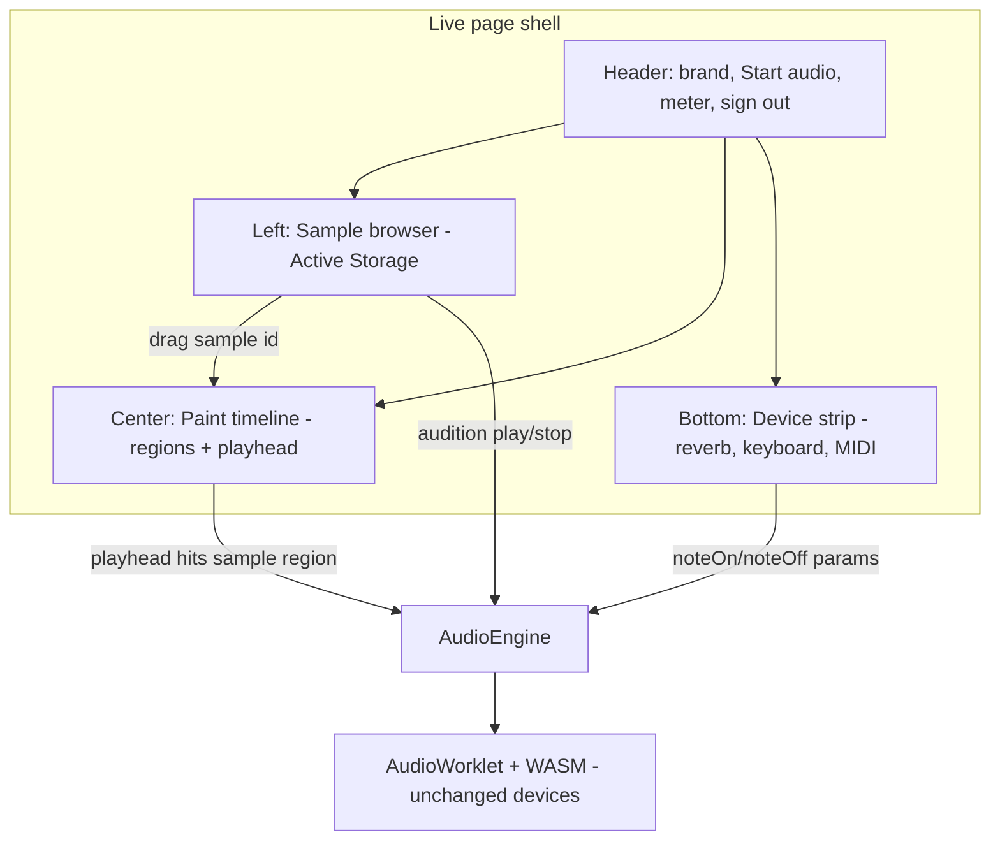
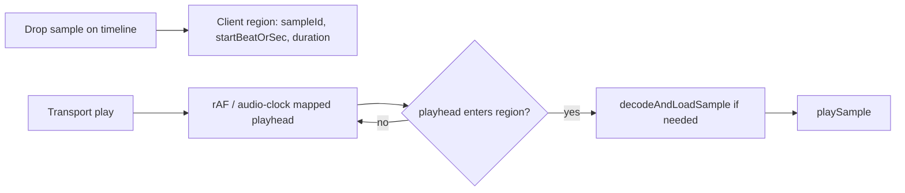

# Ableton Workstation Shell - Plan

## Goal Capsule

- **Objective:** Reshape the Ambient Live page into an Ableton-inspired workstation shell — browser-left sample library, center paint timeline window, bottom device/effects strip — so paint-as-performance has a real session layout without expanding into VST hosting or rewriting onto the untracked BB plugin.
- **Product authority:** Kieran Klaassen — sole user and product owner. Product identity and deferred paint work carry from `docs/plans/2026-07-21-001-feat-ambient-live-plan.md` (origin R1–R4, R12, R13). Session-settled layout decisions from the LFG brief for this run.
- **Stop conditions:** stop if implementation evidence invalidates a session-settled decision — report rather than substitute a different architecture (especially: do not silently retarget `bb-plugin-ambient-live/`).
- **Open blockers:** None.
- **Execution profile:** code on a clean feature branch (do not smash MIDI work on `feat/midi-keyboard-input`). Prefer smoke/runtime proof for layout chrome; unit-test pure timeline/region helpers.
- **Tail ownership:** caller / `ce-work` after this plan.

---

## Product Contract

### Summary

Ambient Live’s live page today is a stacked single-column instrument (start audio, keyboard, reverb, samples). This slice turns that page into a three-region workstation shell: Active Storage sample browser on the left, a paint-native timeline window in the center, and a bottom strip for built-in devices (reverb + relocated play surfaces). It advances the origin product’s paint-timeline identity without shipping clip-grid DAW chrome, plugin hosting, or a BB-plugin rewrite.

### Problem Frame

The product plan already defines paint-as-performance on a slow visual timeline (origin R1–R4) and deferred that work out of v0.1. The playable synth, reverb, and sample library exist, but the page still reads as a vertical demo form — not a session. The user wants an Ableton-shaped spatial layout (browser / arrangement / devices) while keeping Ambient’s paint model and Rails sample SoT. The gap is UI shell and first timeline materialization, not a new audio architecture.

### Key Decisions

- **Paint-as-performance remains the capture/composition model; the center pane is a paint timeline, not an Ableton clip grid.** (session-settled: user-approved — chosen over record-then-arrange / piano-roll-first: product identity is painting sound onto a slow timeline.) Governs R7, R8, R9, R10.
- **Built-in devices only for this slice; no VST/AU hosting.** (session-settled: user-approved — chosen over day-one plugin hosting: Valhalla-class built-in reverb + ambient devices suffice; hosting forces a native path.) Governs R11, R12.
- **Server Active Storage remains the sample library source of truth; the left sidebar browses that library.** (session-settled: user-approved — chosen over browser-only storage as SoT: Safari eviction risk.) Governs R4, R5, R6.
- **Implement on the existing Rails + Inertia live page (`app/frontend/pages/live/`), not the untracked `bb-plugin-ambient-live/` package.** (session-settled: user-directed — chosen over implementing only in the BB plugin: LFG target is the Ambient Live Rails instrument already running.) Governs R1, R2, R3.

### Requirements

R-IDs below are plan-local. Citations into the origin product plan use the `origin R…` prefix.

**Layout shell**

- R1. The live page presents three persistent regions after load: left sample browser, center timeline window, bottom device/effects strip (Ableton-inspired spatial roles; Ambient-native visuals).
- R2. The layout is full-viewport (or near full-viewport) session chrome — not a narrow centered form stack — while keeping Start audio, output meter, and sign-out reachable.
- R3. Existing sine synth (pointer/computer keys), MIDI keyboard path when present, reverb controls, and sample upload/play/stop/delete remain usable after the relayout.

**Sample browser**

- R4. The left sidebar lists the signed-in user’s Active Storage samples (Inertia props already provided by `LiveController`), with upload and delete retained.
- R5. Sidebar rows support drag-start so samples can be dragged into the timeline.
- R6. Sidebar keeps an immediate Play/Stop affordance for auditioning without requiring a timeline drop.

**Paint timeline**

- R7. The center pane is a paint-oriented timeline surface with a visible playhead and basic transport (play / pause / stop or equivalent) that advances the playhead over a slow loopable span.
- R8. Dropping a sample from the sidebar onto the timeline creates a persistent sample region at the drop time (client-side composition state for this slice).
- R9. When transport runs, the playhead crossing a sample region triggers that sample through the existing engine path (decode/load + play), preserving reverb routing.
- R10. The timeline visual language is Ambient-native (fluid paint canvas / regions), not a Session-view clip grid or piano roll.

**Devices strip**

- R11. The bottom strip hosts the existing reverb device controls and the relocated play surfaces (on-screen keyboard and MIDI controls when present).
- R12. No new DSP devices (delay, granular) and no plugin hosting ship in this slice.

### Key Flows

- F1. Session layout
  - **Trigger:** Signed-in user opens the live page.
  - **Steps:** Sees left browser, center timeline, bottom devices; starts audio from the shell chrome; plays synth and adjusts reverb from the bottom strip.
  - **Outcome:** Page reads as a workstation session. **Covers R1, R2, R3, R11.**
- F2. Audition then place
  - **Trigger:** User wants a sample on the composition.
  - **Steps:** Auditions via sidebar Play; drags the sample onto the timeline at a desired time; region appears; transport playhead triggers the sample through reverb when it crosses the region.
  - **Outcome:** Sample material lives on the timeline without a separate record-arm step. **Covers R4, R5, R6, R7, R8, R9.**
- F3. Paint-identity guard
  - **Trigger:** User looks at the center pane for arrangement affordances.
  - **Steps:** Sees a paint/timeline canvas with regions and playhead — not clip slots, not a piano roll.
  - **Outcome:** Ableton spatial roles without Ableton Session/Arrangement identity. **Covers R10.**

### Acceptance Examples

- AE1. **Covers R1, R2.** Given a signed-in visit to the live page, when the page renders, then left, center, and bottom regions are simultaneously visible without scrolling the whole instrument away (narrow viewports may collapse gracefully but desktop session layout holds).
- AE2. **Covers R3, R11.** Given audio started, when the user plays the on-screen keyboard and moves a reverb slider in the bottom strip, then sine + reverb behave as before the relayout.
- AE3. **Covers R4, R6.** Given uploaded samples in the library, when the user presses Play on a sidebar row, then the sample auditions through the engine/reverb path.
- AE4. **Covers R5, R8.** Given a sample row, when the user drags it onto the timeline, then a sample region appears at a time derived from the drop position.
- AE5. **Covers R7, R9.** Given a placed sample region, when transport plays and the playhead crosses the region, then the sample becomes audible through the reverb.
- AE6. **Covers R10, R12.** Given the shipped UI, when inspected, then there is no clip-slot grid, piano roll, or VST/plugin browser.

### Success Criteria

- Opening the live page feels like entering a session layout, not a stacked demo form.
- Sample audition + drag-to-timeline + playhead-triggered playback works with the existing WASM engine (no new C++ devices required).
- Origin paint identity (slow visual timeline, not clip grid) is visually unambiguous.
- MIDI work already on the live page remains wired after relocation.
- `npm run check` and relevant Vitest suites pass; Rails sample endpoints unchanged in contract.

### Scope Boundaries

**In scope**

- Live-page three-region shell and visual polish within the existing zinc/teal language
- Active Storage sample sidebar (browse, search/filter optional, upload, delete, audition, drag source)
- Session-local folder/file browse in the sidebar (File System Access with multi-file fallback; not a second SoT)
- Ableton-inspired visual treatment (centralized gray/type/accent tokens)
- Paint-native timeline canvas with playhead, transport, sample regions, playhead-triggered sample playback
- Bottom strip for reverb + keyboard + MIDI controls
- Pure-TS helpers for time mapping / region model with unit tests
- Clean feature branch for this work

**Out of scope / Outside this product's identity**

- VST/AU hosting or a plugin browser
- Ableton Session-view clip slots / scene launching as the composition model
- MIDI piano-roll editing
- Implementing this slice only inside `bb-plugin-ambient-live/`
- Local-folder browse as a second persistence / library SoT (local is session browse only)
- Bounce/export, live audio input, factory preset packs

### Deferred to Follow-Up Work

- Full paint-stroke capture for synth/granular parts (origin R1–R3 stroke model beyond sample regions)
- Erase/subtractive paint tooling and multi-lane paint layers
- Grain-delay / echo / granular devices in the bottom strip (origin R7, R9)
- Timeline persistence to the server (presets / pieces)
- Multi-voice scheduled sample polyphony beyond the engine’s current single sample voice
- Browser-side sample cache half of origin R13
- Responsive mobile layout parity (desktop session is the bar for this slice)

### Actors

- A1. Solo musician using Ambient Live in a desktop browser (signed in), arranging ambient material with samples and the sine/MIDI play surface.

---

## Planning Contract

### Assumptions

Pipeline defaults for open areas (unvalidated agent bets — correct in review if wrong):

- **Visual language:** Ambient-native paint canvas / soft regions for the timeline, not an Ableton clip grid. Ableton informs spatial roles only (browser left, arrangement center, devices bottom).
- **Bottom-strip devices now:** Ship the existing reverb device plus relocated keyboard/MIDI play surfaces. Delays and granular stay deferred.
- **Sidebar content:** Active Storage library remains the uploaded/imported SoT; local folder browse is an additional session-only Places source (`showDirectoryPicker` with multi-file fallback).
- **Drag interaction:** Drag-sample-to-timeline creates a sample region; sidebar retains Play/Stop audition. No Ableton-style rack/slot drop targets in the center pane.
- **Engine depth:** No new C++ DSP for this slice. Timeline scheduling lives in TypeScript against existing `AudioEngine` sample/synth APIs; single sample-voice limitations are accepted and documented in Risks.
- **Branching:** Implement on a new branch such as `feat/ableton-workstation-shell` from the appropriate base (main or post-MIDI tip). Do not rewrite or squash unrelated MIDI commits on `feat/midi-keyboard-input`.

### Key Technical Decisions

- KTD1. **Target the Rails Inertia live page under `app/frontend/pages/live/`; do not retarget `bb-plugin-ambient-live/`.** (session-settled: user-directed — chosen over implementing only in the BB plugin: LFG target is the Ambient Live Rails instrument already running.) Instantiates Product Key Decision Governs R1, R2, R3.
- KTD2. **Keep the audio engine free of Inertia/server state; shell and timeline state live in React beside the page.** Instantiates origin engine boundary (origin R16) — UI may hold composition regions; `AudioEngine` still receives only PCM, note, and param messages.
- KTD3. **No VST/AU hosting and no new device DSP in this slice; bottom strip wraps existing reverb + play surfaces.** (session-settled: user-approved — chosen over day-one plugin hosting.) Instantiates Product Key Decision Governs R11, R12.
- KTD4. **Left sidebar Places browser: Active Storage library (SoT for uploads) plus session-local folder/file browse for audition/drag — not a second persistence SoT.** (session-settled: user-directed follow-up — chosen over Active Storage-only sidebar: musicians need local folder access without uploading everything.) Instantiates Product Key Decision Governs R4, R5, R6 / origin R12–R13. Prefer File System Access `showDirectoryPicker`; fallback to multi-file / directory input when unavailable.
- KTD10. **Ableton-inspired visual language via centralized tokens (neutral gray chrome, geometric UI sans, sparse orange accent, 0–2px radii, flat dense controls) — not teal/card/glass aesthetics.** (session-settled: user-directed follow-up.) Instantiates layout identity without adopting Ableton clip-grid composition.
- KTD5. **Center timeline is a paint-native canvas with a client-side region model and playhead clock in TypeScript; first material type is sample regions from drag-drop.** Instantiates Product Key Decision Governs R7, R8, R9, R10. Rejected: Session-view clip grid; deferred: full synth paint-stroke encoder.
- KTD6. **Playhead-triggered sample playback calls the existing decode/load + `playSample` path; if a prior sample is still the loaded buffer, skip re-decode when the same sample id retriggers.** Accept single-voice sample stealing as v1 timeline behavior.
- KTD7. **Prefer CSS grid/flex full-height shell in `live/index.tsx` with extracted presentational components (`sample-browser`, `timeline`, `device-strip`) under `app/frontend/pages/live/`.** Keep zinc/teal visual language; avoid introducing a second design system from the BB plugin.
- KTD8. **Region duration defaults to the decoded audio duration once known; until decode completes, use a short placeholder duration so the region is visible.** Drop time sets `startSec` from pointer x; vertical drop position is ignored in v1 (single paint lane).
- KTD9. **Trigger policy: rising-edge only while transport is playing — fire once when playhead crosses `startSec` from before to after; if playback starts with the playhead already inside a region, do not auto-fire until a future loop crosses the start again.** Predictable and easy to unit-test; avoids sustain-style retrigger every frame.

### High-Level Technical Design





Layout composition (directional):

```mermaid
flowchart TB
  ROOT[min-h-screen flex flex-col]
  ROOT --> TOP[header]
  ROOT --> BODY[flex-1 min-h-0 grid: sidebar | timeline]
  ROOT --> BOTTOM[device strip]
  BODY --> SIDE[w-64/72 sample browser]
  BODY --> MAIN[timeline canvas]
```

### Sequencing

U1 (shell) first so regions exist. U2 (sidebar) and U4 (device strip) can proceed in parallel after U1. U3 (timeline + regions + playhead trigger) depends on U1 and on U2’s drag MIME/contract. Prefer landing U1→U2→U4→U3 if serial; U3 last because it carries the most product risk.

### Risks & Dependencies

- **Single sample voice:** Engine exposes one loaded sample buffer / play path. Rapid overlapping regions will steal. Mitigation: document; optionally debounce retrigger; defer polyphonic sample voices.
- **Paint vs clip confusion:** Ableton analogy can pull implementers toward clip slots. Mitigation: KTD5 + AE6; review UI against paint identity.
- **MIDI branch coupling:** Current git branch is `feat/midi-keyboard-input`. Mitigation: new feature branch; relocate `MidiControls` without rewriting MIDI logic.
- **No timeline tests today:** Add pure helpers under Vitest; layout/smoke via Verification Contract.
- **BB plugin distraction:** Untracked plugin has a folder browser + slot grid. Mitigation: KTD1 — patterns may inspire drag MIME naming only; do not import that package.

### Open Questions

- None blocking. Deferred: server persistence of timeline regions; synth paint strokes; multi-voice sample scheduling.

---

## Implementation Units

### U1. Workstation shell layout chrome

- **Goal:** Replace the stacked `max-w-3xl` live page with a full-height three-region shell (header + sidebar/timeline body + bottom strip placeholders).
- **Requirements:** R1, R2 — KTD1, KTD7
- **Dependencies:** none
- **Files:**
  - Modify: `app/frontend/pages/live/index.tsx`
  - Create (stubs ok): `app/frontend/pages/live/sample-browser.tsx`, `app/frontend/pages/live/timeline.tsx`, `app/frontend/pages/live/device-strip.tsx` (or equivalent names)
- **Approach:**
  1. Introduce a column flex shell: header, `flex-1` body grid (sidebar | main), bottom strip.
  2. Move Start audio / error / meter / sign-out into the header without changing engine boot rules (gesture-gated `AudioEngine.start`).
  3. Leave placeholder panels for sidebar/timeline/devices if U2–U4 land separately — placeholders must establish the spatial roles.
- **Patterns to follow:** Existing zinc-950 / teal accents in `live/index.tsx`; keep engine refs and note-hold refcounting in the page (or a thin colocated hook), not in Inertia props.
- **Execution note:** Prefer browser smoke for layout; no unit tests required for pure chrome.
- **Test scenarios:**
  - Test expectation: none for structural chrome — verified by typecheck + smoke (AE1).
- **Verification:** Desktop viewport shows three regions; `npm run check` green; audio still starts from the header control.

### U2. Active Storage sample browser sidebar

- **Goal:** Relocate and restyle `SampleLibrary` into the left browser with drag-source rows and retained audition/upload/delete.
- **Requirements:** R3, R4, R5, R6 — KTD4 — AE3, AE4 (drag half)
- **Dependencies:** U1
- **Files:**
  - Modify: `app/frontend/pages/live/sample-library.tsx` (or replace via `sample-browser.tsx` and update imports)
  - Modify: `app/frontend/pages/live/index.tsx` (wire props/callbacks into sidebar slot)
  - Create: `app/frontend/pages/live/sample-drag.ts` (MIME constant + payload helpers) and `app/frontend/pages/live/sample-drag.test.ts`
- **Approach:**
  1. Keep Inertia upload/delete flows and `SampleItem` shape.
  2. Add optional client-side name filter if cheap; not required for DoD.
  3. On drag start, set a dedicated MIME/payload carrying `sampleId` (and name/url as needed by the drop handler).
  4. Preserve Play/Stop audition through existing `playSample` / `stopSample` page callbacks.
- **Patterns to follow:** Current `SampleLibrary` form + list; HTML5 DnD like any simple drag source (do not import BB plugin code).
- **Test scenarios:**
  - Happy path: drag payload helper serializes/deserializes a sample id.
  - Edge: empty / malformed drop data → helper returns null (timeline ignores).
  - Smoke: upload still creates a list row; Play auditions when audio started.
- **Verification:** Sidebar fills the left region; audition and upload work; unit tests for drag payload green.

### U3. Paint timeline window with sample regions and playhead trigger

- **Goal:** Ship the center timeline: playhead, transport, drop-to-create sample regions, and playhead-triggered sample playback via existing engine APIs.
- **Requirements:** R7, R8, R9, R10 — KTD2, KTD5, KTD6, KTD8, KTD9 — AE4, AE5, AE6
- **Dependencies:** U1, U2
- **Files:**
  - Create/modify: `app/frontend/pages/live/timeline.tsx`
  - Create: `app/frontend/pages/live/timeline-model.ts` (regions, time mapping, hit detection)
  - Create: `app/frontend/pages/live/timeline-model.test.ts`
  - Modify: `app/frontend/pages/live/index.tsx` (transport ↔ engine wiring; sample fetch/decode on trigger)
- **Approach:**
  1. Model regions as pure data: `{ id, sampleId, startSec, durationSec }` (shape directional).
  2. Map pointer x ↔ time with a fixed loop length (constant ok for v1; expose loop length only if needed).
  3. Accept drops using U2 MIME; create a region at drop time; render regions on a canvas or absolutely positioned layer over a paint-like background — not clip slots.
  4. Transport advances playhead with `requestAnimationFrame` (or `AudioContext.currentTime` mapping); on region start crossings apply KTD9; load/play via KTD6/KTD8.
  5. Do not implement synth paint strokes or erase tools in this unit (deferred).
- **Patterns to follow:** Engine boundary in `app/frontend/audio/audio-engine.ts`; page owns fetch → `decodeAndLoadSample` → `playSample` as today’s audition path.
- **Execution note:** Unit-test the model (mapping, hit/rising-edge) first; prove audible trigger with browser smoke.
- **Test scenarios:**
  - Happy path: `xToTime` / `timeToX` round-trip within tolerance on a fixed width.
  - Happy path: playhead crossing `startSec` yields a single trigger event (rising edge), not a trigger every frame while inside.
  - Edge: playhead starts already inside a region → no trigger until a later loop crosses `startSec` (KTD9).
  - Edge: unknown sample id on trigger → no throw; skip.
  - Error: malformed drop payload → no region created.
  - Smoke **Covers AE5.**: drop sample, press play, hear sample near region start through reverb.
- **Verification:** Timeline dominates center pane; regions persist for the session; Vitest model tests green; smoke passes.

### U4. Bottom device/effects strip

- **Goal:** Move reverb controls and play surfaces (keyboard + MIDI controls) into the bottom strip without regressing synth/MIDI/reverb behavior.
- **Requirements:** R3, R11, R12 — KTD3, KTD7 — AE2
- **Dependencies:** U1
- **Files:**
  - Create/modify: `app/frontend/pages/live/device-strip.tsx`
  - Modify: `app/frontend/pages/live/reverb-controls.tsx`, `keyboard.tsx`, `midi-controls.tsx` only as needed for compact strip layout
  - Modify: `app/frontend/pages/live/index.tsx` (callbacks/props into the strip)
- **Approach:**
  1. Bottom strip contains reverb sliders and the playable keyboard; MIDI controls sit beside or under the keyboard when that feature is present on the branch.
  2. Do not add delay/granular UI placeholders that imply shipped devices — omit or mark deferred only if clutter-free.
  3. Preserve `enabled={started}` gating and existing param/note callbacks.
- **Patterns to follow:** Current control components; compact spacing suitable for a strip (horizontal slider grid ok).
- **Test scenarios:**
  - Smoke **Covers AE2.**: keyboard + reverb still audible/adjustable from the strip after Start audio.
  - Regression: MIDI connect/play still works if `midi-controls.tsx` is in the tree.
  - Test expectation: none beyond typecheck for pure relocation chrome.
- **Verification:** Bottom strip hosts devices; no plugin browser; `npm run check` green.

---

## Verification Contract

| Gate | Command / proof | Applies to |
|---|---|---|
| Typecheck | `npm run check` | All units |
| Unit tests | `npm test` (Vitest) for drag payload + timeline model | U2, U3 |
| Rails samples | Existing `bin/rails test` sample/auth coverage still green if touched; no contract change expected | U2 |
| Engine native | `script/test-engine` only if C++ touched — **do not** change WASM for this slice | none expected |
| Browser smoke | Sign in (`kieran@example.com` / local seed password) → `http://localhost:3100/` → Start audio → three-region layout → keyboard/reverb from bottom → sidebar audition → drag sample to timeline → transport triggers sample | U1–U4 / AE1–AE6 |

---

## Definition of Done

- U1–U4 complete with verification outcomes met.
- R1–R12 satisfied; AE1–AE6 covered by tests and/or smoke.
- Session-settled decisions preserved: paint timeline (not clip grid), built-ins only, Active Storage sidebar SoT, Rails live page target (not BB plugin).
- No new VST/hosting surface; local folder is session browse only (not a sample SoT); no smash of unrelated MIDI history — work lands on a dedicated feature branch.
- Ableton-like visual treatment via shared CSS/Tailwind tokens (KTD10).
- Abandoned experiment code from dead-end layout attempts removed from the diff.

---

## Sources & Research

- Origin product plan: `docs/plans/2026-07-21-001-feat-ambient-live-plan.md` — paint timeline deferred (R1–R4); samples Active Storage (KTD-6); engine boundary (KTD-8).
- Sibling plan: `docs/plans/2026-07-21-002-feat-midi-keyboard-input-plan.md` — MIDI controls live beside the keyboard; relocate, don’t rewrite.
- Live page today: `app/frontend/pages/live/{index,sample-library,reverb-controls,keyboard,midi-controls}.tsx` — stacked column; no timeline modules under `app/`.
- Engine API: `app/frontend/audio/audio-engine.ts` — `noteOn`/`noteOff`, `decodeAndLoadSample`, `playSample`/`stopSample`, `setParam`.
- Samples controller/props: `app/controllers/live_controller.rb`, `app/controllers/samples_controller.rb`.
- Institutional learnings: `docs/solutions/` empty — none applied.
- External research: skipped — local patterns and origin product contract are sufficient for a UI-shell slice; Ableton informs spatial roles only.
- Research substitution note: repo-research / learnings / flow analysis ran in-thread (harness has no separate subagent dispatch for this pipeline pass); findings are not independently corroborated.
