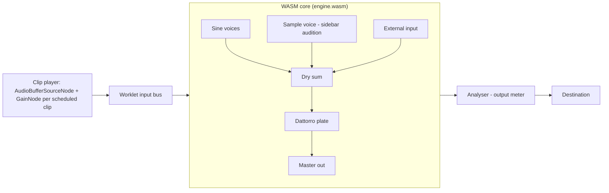
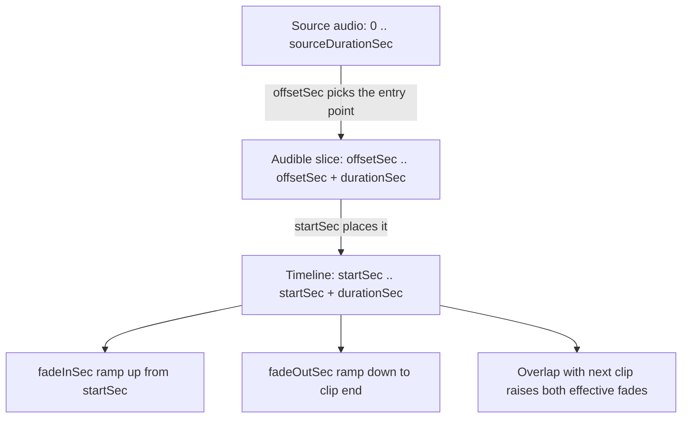
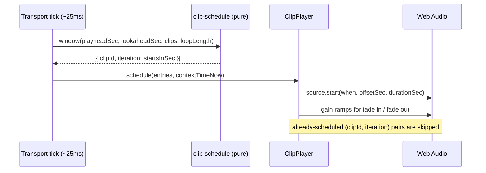

# Timeline Sample Clips - Plan

## Goal Capsule

- **Objective:** Turn timeline regions into editable audio clips — real waveform, real decoded length, drag to reposition, trim from the edges, fade in/out handles, and crossfades where clips overlap — with the audio matching what the clip draws.
- **Product authority:** Kieran Klaassen — sole user and product owner. Paint-timeline identity carries from `docs/plans/2026-08-07-001-feat-ableton-workstation-shell-plan.md` (origin R7–R10, KTD5). Ableton informs clip affordances only; the surface stays a single paint lane, not a Session-view grid.
- **Stop conditions:** stop and report if honoring a clip edit in audio would require abandoning the plate reverb path for clips, or if the WASM artifact cannot be rebuilt locally.
- **Open blockers:** None.
- **Execution profile:** code on `feat/timeline-sample-clips`, which already carries two unrelated commits (resizable panes, local-folder fallback) that ship in the same PR. Unit-test the pure clip/scheduling math; smoke-verify the visual and audio behavior in the running dev server at `http://localhost:3100`.
- **Tail ownership:** caller (LFG) — plan, work, review, ship, merge, deploy.

---

## Product Contract

### Summary

Timeline regions today are fixed-width teal rectangles with a name label. They are placed once and never edited, and their width is a 2-second placeholder until the sample happens to load. This slice makes each region an audio clip the user can see and shape: the decoded waveform is drawn inside it, its width is the real decoded length, and pointer edits move it, trim it, and fade it. Overlapping clips crossfade. The audio follows the drawing — trim, fades, and crossfades are audible, not decorative.

### Problem Frame

The paint timeline can place sound but not shape it. A dropped sample is an opaque block: the user cannot see what is in it, cannot tell how long it is, cannot correct a misplaced drop except by re-dropping, and cannot control how it enters or leaves. Ableton solved this with the clip — waveform, edges, fade handles — and that vocabulary is what the user is asking for. The obstacle is that the current audio path can only hold one decoded sample and can only fire it whole from its start, so any clip edit would be a lie the moment it is drawn.

### Key Decisions

- **Clips are edited in place on the single paint lane; the surface stays a paint timeline, not a clip grid.** (session-settled: user-directed — chosen over adding Session-view slots or multi-track lanes: the request is Ableton's clip *vocabulary* on an Ambient-native surface.) Governs R1, R9, R10.
- **Every visible clip edit is audible.** (session-settled: user-directed — chosen over a visual-only editing layer over the existing single-shot trigger: fades and crossfades that do nothing are a broken product.) Governs R5, R6, R7, R8.
- **Clip playback moves to Web Audio while the WASM core keeps the reverb.** (session-settled: user-approved — chosen over building a multi-slot sampler in C++: the browser sampler is sample-accurate and polyphonic today, and the portable core keeps every DSP device.) Governs R7, R8, R11.

### Requirements

R-IDs are plan-local. Citations into the workstation shell plan use the `origin R…` / `origin KTD…` prefix.

**Clip appearance**

- R1. A clip on the timeline draws the waveform of its audible slice, scaled to the clip's drawn width.
- R2. A clip's width is its real decoded duration mapped through the timeline's time scale, not a placeholder.
- R3. A clip whose audio is not yet decoded stays visible at a placeholder width and takes its real width when decoding completes.
- R4. Clip chrome stays minimal and dense: waveform, fade shape, and a single truncated name — no per-clip toolbars or value readouts.

**Clip editing**

- R5. Dragging a clip body moves it to another timeline position.
- R6. Dragging a clip's left or right edge trims it, changing which slice of the source is audible without moving the untouched edge.
- R7. Each clip has a fade-in and a fade-out handle; dragging a handle sets that fade's length.
- R8. Two clips that overlap in time crossfade across the overlap.

**Behavior and audio**

- R9. Clip edits are constrained to the source: a clip cannot be trimmed past either end of its decoded audio, and its fades cannot exceed its own length.
- R10. Edits stay on the single paint lane and inside the loop span (`LOOP_LENGTH_SEC`).
- R11. Playback honors the clip: it starts at the trimmed offset, plays for the trimmed length, applies the fades, and reaches the output through the existing plate reverb.
- R12. Sidebar audition, the synth/MIDI play surfaces, and the reverb device keep working unchanged.

### Key Flows

- F1. Place and see
  - **Trigger:** User drags a sample from the browser onto the timeline.
  - **Steps:** A clip appears at the drop time; the sample decodes; the clip takes its real width and draws its waveform.
  - **Outcome:** The user can read the material on the timeline. **Covers R1, R2, R3.**
- F2. Shape the clip
  - **Trigger:** User wants the sound to land somewhere else, shorter, and softer at the edges.
  - **Steps:** Drags the clip body to a new time; drags the right edge in to shorten it; drags the fade handles to taper both ends.
  - **Outcome:** The clip reads and plays as edited. **Covers R5, R6, R7, R9, R10, R11.**
- F3. Overlap into a crossfade
  - **Trigger:** User pulls one clip so it overlaps the next.
  - **Steps:** The overlap draws as complementary fades on both clips; playback fades one into the other across it.
  - **Outcome:** Two sounds blend instead of stacking abruptly. **Covers R8, R11.**

### Acceptance Examples

- AE1. **Covers R1, R2.** Given a 6-second sample dropped on a 32-second loop, when it finishes decoding, then the clip occupies about 18.75% of the timeline width and draws its waveform inside.
- AE2. **Covers R3.** Given audio has not been started, when a sample is dropped, then the clip is visible at the placeholder width and gains its real width and waveform after audio starts and the sample decodes.
- AE3. **Covers R5, R10.** Given a clip at 4s, when the user drags it 2s right, then it sits at 6s, and dragging it past the loop end clamps it so it stays fully inside the loop.
- AE4. **Covers R6, R9.** Given a 6-second clip, when the user drags its left edge 2s right, then the clip starts 2s later, is 4s long, and plays from 2s into the source; dragging that edge left past the source start stops at the source start.
- AE5. **Covers R7, R9.** Given a 4-second clip, when the user drags the fade-in handle to 3s and then the fade-out handle to 3s, then the two fades are clamped so they do not exceed the clip's own length.
- AE6. **Covers R8.** Given a clip ending at 10s and a second clip starting at 9s, when transport plays across 9–10s, then the first clip fades out and the second fades in across that second.
- AE7. **Covers R11, R12.** Given a trimmed clip with fades and reverb mix up, when the playhead reaches it, then the audible slice matches the drawn slice and carries reverb; auditioning the same sample from the sidebar still works.

### Success Criteria

- A dropped sample reads as an Ableton-style clip: waveform, correct length, editable edges.
- What the clip draws is what the clip plays — trim, fades, and crossfade all audible.
- No new chrome on the paint surface beyond the clip itself.
- `npm run check`, `npm test`, and `script/test-engine` pass; the committed `engine.wasm` is rebuilt from the changed C++.

### Scope Boundaries

**In scope**

- Clip data model, edit math, and crossfade derivation as pure TypeScript with unit tests
- Waveform peak extraction at decode time and per-sample caching in the page
- Clip rendering (waveform, fade shapes, overlap crossfade) inside the existing timeline surface
- Pointer editing: move, trim both edges, fade handles
- A Web Audio clip player with lookahead scheduling for timeline playback
- An input bus on the WASM engine so clip audio reaches the plate reverb, and the rebuilt `engine.wasm`

**Out of scope / Outside this product's identity**

- Session-view clip slots, scene launching, or multi-track lanes
- MIDI piano-roll or automation-envelope editing
- Clip warping, pitch/tempo stretch, reverse, or gain per clip
- Timeline persistence to the server
- Bounce/export

### Deferred to Follow-Up Work

- Multi-slot sampler in the C++ core so a native shell can play clips without the browser sampler (KTD3's rejected alternative)
- Constant-power crossfade curves and non-linear fade shapes (KTD5)
- Snap-to-grid and quantized clip edits
- Undo/redo for clip edits
- Clip duplicate, delete, and multi-select
- Per-clip gain and clip color

### Actors

- A1. Solo musician arranging ambient material on the paint timeline in a desktop browser.

---

## Planning Contract

### Assumptions

Pipeline defaults for open areas (unvalidated agent bets — correct in review if wrong):

- **Fade shape:** linear, so the drawn triangle is the applied gain (KTD5).
- **Crossfade authoring:** derived from overlap rather than a separate crossfade object the user drags (KTD6). Ableton's arrangement crossfade is edge-derived too.
- **Edit resolution:** free (unquantized) dragging, matching the paint identity; no snapping in this slice.
- **Deletion:** not added here; a mis-dropped clip is fixed by dragging it, per the request's list.
- **Placeholder clips:** a clip whose source has not decoded is movable but not trimmable, since its source bounds are unknown.
- **Keyboard access:** pointer-only editing this slice; the existing `?` cheat sheet gains no new entries.

### Key Technical Decisions

- KTD1. **Extend `SampleRegion` into a clip: add `sourceDurationSec`, `offsetSec`, `fadeInSec`, `fadeOutSec` beside the existing `startSec`/`durationSec`.** `startSec` stays timeline position, `durationSec` becomes the audible length (not the source length), and `offsetSec` is where playback enters the source. Instantiates origin KTD5/KTD8. All edit math lives in pure functions so the same numbers drive drawing and scheduling.
- KTD2. **Waveform peaks are computed once, at decode time, inside the audio layer, and returned with the duration.** `decodeAndLoadSample` already holds the decoded `AudioBuffer` at the engine's sample rate; bucket it to min/max peaks there before the PCM copy is transferred. Rejected: a second decode in the page — it doubles work and risks a sample-rate mismatch against the engine's context.
- KTD3. **Timeline clips play through Web Audio (`AudioBufferSourceNode` + `GainNode`) scheduled on the audio clock; the WASM core gains a stereo input bus so clip audio still enters the plate reverb.** (session-settled: user-approved — chosen over a multi-slot sampler in C++: `start(when, offset, duration)` plus gain automation gives exact trim, fades, and crossfade today, while a C++ arena plus voice pool is a much larger change for the same audible result.) Instantiates Product Key Decision Governs R7, R8, R11. The portable core keeps every DSP device; only clip scheduling is browser-side, and the C++ sampler stays for a future native shell.
- KTD4. **Decoded `AudioBuffer`s are cached per sample id in the audio layer and shared by the clip player and the audition path.** One decode feeds peaks, the WASM audition voice, and clip playback.
- KTD5. **Fades are linear and the drawn triangle equals the applied gain.** A single `clipGainAt` function serves rendering and audio automation. Rejected for v1: constant-power crossfade curves — they would make the drawing lie about the gain, and linear is Ableton's default clip fade shape.
- KTD6. **Crossfades are derived from overlap, not stored.** When a clip's audible span overlaps the next clip's, both get an effective fade covering the overlap; an explicit user fade wins when it is longer. Nothing new is persisted, so a move or trim recomputes the crossfade for free.
- KTD7. **Pointer editing uses native pointer events with pointer capture, mirroring `app/frontend/pages/live/pane-splitter.tsx`.** Hit zones: clip body moves, an edge strip on each side trims, a handle in each top corner sets a fade. The drag hook converts pixel deltas to seconds through the existing `xToTime` scale and hands seconds to the pure edit functions.
- KTD8. **The audio clock is authoritative for transport while the engine is running.** Anchor `playheadSec` to `AudioContext.currentTime` on play so scheduled clip starts and the drawn playhead cannot drift; keep the existing rAF accumulation as the fallback when no engine exists. Supersedes origin KTD9 (rAF rising-edge triggering) for clips — the rAF loop still drives the drawn playhead, but it no longer decides when audio fires.
- KTD9. **Sidebar audition keeps using the WASM sample voice unchanged.** Bounds the diff and keeps the C++ sample path exercised; the clip player owns the timeline only.

### High-Level Technical Design

Signal path after this slice — clips join the synth voices ahead of the reverb rather than bypassing it:

Clip anatomy — the fields an edit changes, and what each one draws:

Scheduling loop — a lookahead tick turns clip times into audio-clock times:

Edit-state ownership: `index.tsx` owns the clip array; `timeline.tsx` owns hit-testing and drag gestures; `timeline-clips.ts` owns every number that changes; `clip-player.ts` owns audio nodes. No component computes clip geometry twice.

### Risks & Dependencies

- **Rebuilt WASM artifact.** `app/frontend/audio/engine.wasm` is committed and CI does not rebuild it, so the C++ change is only real if `script/build-engine` runs locally and the new artifact is committed. Emscripten 6.0.3 is present on this machine.
- **Transport re-anchoring.** Moving the playhead onto the audio clock touches play/pause/stop/seek. A missed re-anchor shows up as a jumping playhead. Mitigated by keeping the rAF drawing loop and changing only where its time comes from.
- **Stale scheduled audio after an edit.** A clip edited while playing must not play its old shape. Mitigated by cancelling not-yet-started sources and rescheduling from the current position on any clip change.
- **Memory.** Decoded `AudioBuffer`s are retained per sample for waveform and playback. Bounded by the sample library the user actually touches; local-folder samples already drop out of the cache when the folder is cleared.

---

## Implementation Units

### U1. Clip model and edit math

**Goal:** One pure module that owns every number a clip edit changes, so drawing and audio cannot disagree.

**Requirements:** R5, R6, R7, R8, R9, R10 (KTD1, KTD5, KTD6).

**Dependencies:** none.

**Files:**

- `app/frontend/pages/live/timeline-model.ts` (extend `SampleRegion`, `createSampleRegion`)
- `app/frontend/pages/live/timeline-clips.ts` (new)
- `app/frontend/pages/live/timeline-clips.test.ts` (new)
- `app/frontend/pages/live/timeline-model.test.ts` (extend)

**Approach:**

1. Add `sourceDurationSec`, `offsetSec`, `fadeInSec`, `fadeOutSec` to `SampleRegion`; default a new clip to offset 0, no fades, and the placeholder duration until the source duration is known.
2. Add `moveClip`, `trimClipStart`, `trimClipEnd`, `setFadeIn`, `setFadeOut` — each takes the clip plus a delta or target in seconds and returns a new clip clamped per R9/R10.
3. Add `applySourceDuration(clip, sourceDurationSec)` for the decode-completes case: it sets the source length and, while the clip is still at placeholder length, takes the full source as the audible slice.
4. Add `clipGainAt(clip, secondsIntoClip)` returning the linear fade gain, and `effectiveFades(clips)` returning per-clip fade lengths after overlap crossfade derivation (KTD6).
5. Keep a minimum clip length so a trim cannot collapse a clip to zero width.

**Patterns to follow:** existing pure helpers and clamping style in `timeline-model.ts` (`clampTime`, `loopIntervalContains`).

**Test scenarios:**

- Moving a clip by a positive delta shifts `startSec` and leaves `offsetSec` and `durationSec` untouched.
- Moving a clip past the loop end clamps it so `startSec + durationSec` stays within `LOOP_LENGTH_SEC`.
- Moving a clip past 0 clamps `startSec` to 0.
- Trimming the start right by 2s adds 2s to `startSec` and `offsetSec` and removes 2s from `durationSec`.
- Trimming the start left beyond the source start stops at `offsetSec === 0` and does not extend the clip past the source.
- Trimming the end right beyond the remaining source stops at `offsetSec + durationSec === sourceDurationSec`.
- Trimming either edge inward past the minimum clip length stops at the minimum.
- Setting a fade longer than the clip clamps it to the clip length.
- Setting a fade-in and fade-out that together exceed the clip length clamps the one being edited so their sum equals the clip length.
- `clipGainAt` returns 0 at the clip start with a fade-in, 1 at the end of the fade-in, 1 through the middle with no fades, and 0 at the clip end with a fade-out.
- `effectiveFades` on two non-overlapping clips returns their explicit fades unchanged.
- `effectiveFades` on two clips overlapping by 1s returns a 1s fade-out on the earlier clip and a 1s fade-in on the later one.
- `effectiveFades` keeps an explicit 2s fade when the overlap is only 1s.
- `applySourceDuration` on a placeholder clip takes the full source length; on an already-trimmed clip it keeps the trim.

**Verification:** `npm test` covers every branch above; no component imports the clamping rules directly.

---

### U2. Waveform peaks at decode time

**Goal:** Every decoded sample yields drawable peaks and its true duration, computed once.

**Requirements:** R1, R2, R3 (KTD2, KTD4).

**Dependencies:** none.

**Files:**

- `app/frontend/audio/waveform.ts` (new)
- `app/frontend/audio/waveform.test.ts` (new)
- `app/frontend/audio/audio-engine.ts` (return peaks; cache the decoded buffer)

**Approach:**

1. `computePeaks(channels, frameCount, bucketCount)` buckets frames into min/max pairs from a channel-data accessor, so it is testable without an `AudioBuffer`.
2. `slicePeaks(peaks, offsetSec, durationSec, sourceDurationSec)` returns the peaks covering a clip's audible slice, so a trimmed clip draws the part of the wave it actually plays.
3. `decodeAndLoadSample` computes peaks from the decoded buffer before transferring the PCM copy, and returns `{ durationSec, peaks }`.
4. Cache the decoded `AudioBuffer` and peaks by sample id inside `AudioEngine`, with a way to drop an entry when a local sample disappears.
5. Keep the existing PCM copy and transfer to the worklet unchanged (KTD9) — building the interleaved copy already leaves the source buffer intact.

**Patterns to follow:** the module boundary note at the top of `app/frontend/audio/audio-engine.ts` — the audio layer imports nothing from pages.

**Test scenarios:**

- A ramp of known length buckets into the requested number of peaks.
- Each bucket's min and max bracket the samples in its range.
- A stereo source folds both channels into one peak pair per bucket.
- A frame count smaller than the bucket count still returns one peak per bucket without reading past the end.
- A zero-length source returns flat peaks rather than throwing.
- `slicePeaks` on an untrimmed clip returns the full peak list.
- `slicePeaks` on a clip offset halfway into the source returns the second half of the peaks.
- `slicePeaks` with a zero or unknown source duration returns an empty slice rather than throwing.

**Verification:** `npm test`; dropping a sample in the running app shows a waveform whose shape matches the file.

---

### U3. Clip rendering

**Goal:** A clip that looks like an Ableton clip and reads at a glance — waveform, real width, fade shapes, crossfade.

**Requirements:** R1, R2, R3, R4, R8.

**Dependencies:** U1, U2.

**Files:**

- `app/frontend/pages/live/timeline-clip.tsx` (new)
- `app/frontend/pages/live/timeline.tsx` (render clips through the new component)
- `app/frontend/pages/live/index.tsx` (pass cached peaks down)

**Approach:**

1. Draw the waveform as an inline SVG polygon from the peaks sliced to the clip's audible range, so a trim reveals a different part of the wave.
2. Draw fades as filled corner triangles whose slope is the fade length, using `clipGainAt` so the drawing and the gain agree.
3. Shade the overlap between adjacent clips to read as a crossfade.
4. Keep chrome minimal per R4: waveform, fade shapes, one truncated name, no readouts.
5. Width comes from `durationSec` over `LOOP_LENGTH_SEC`, with the existing minimum width floor for very short clips.

**Patterns to follow:** `al-*` tokens and the dense, low-radius control language already in `timeline.tsx`; no new color literals.

**Test scenarios:** Test expectation: none — presentational shell over math already covered by U1 (`clipGainAt`) and U2 (`slicePeaks`). Verified by the smoke check below.

**Verification:** in the dev server, a dropped sample draws a waveform at the correct width; trimming reveals a different slice; overlapping two clips shades the overlap.

---

### U4. Pointer editing: move, trim, fade

**Goal:** The clip responds to the pointer — body drags move it, edges trim it, corner handles set fades.

**Requirements:** R5, R6, R7, R9, R10.

**Dependencies:** U1, U3.

**Files:**

- `app/frontend/pages/live/use-clip-drag.ts` (new)
- `app/frontend/pages/live/use-clip-drag.test.ts` (new)
- `app/frontend/pages/live/timeline-clip.tsx` (hit zones and cursors)
- `app/frontend/pages/live/timeline.tsx` (drag surface, suppress seek-on-click during a clip drag)
- `app/frontend/pages/live/index.tsx` (apply edits to clip state)

**Approach:**

1. A `clipDragTarget` union — `move`, `trim-start`, `trim-end`, `fade-in`, `fade-out` — resolved from the pointer-down hit zone, with a `never` check where it is dispatched.
2. Pointer capture on pointer-down, seconds-per-pixel from the surface width and `LOOP_LENGTH_SEC`, edits applied through U1's pure functions on every move.
3. Suppress the timeline's seek-on-click while a clip drag is in flight, and after it ends, so a drag does not also move the playhead.
4. A clip whose source duration is unknown exposes only the move zone (Assumptions).

**Patterns to follow:** `app/frontend/pages/live/pane-splitter.tsx` for the pointer-capture drag shape; `use-workstation-panes.ts` for hook structure.

**Test scenarios:**

- A pointer-down 3px inside the left edge resolves to `trim-start`; 3px inside the right edge resolves to `trim-end`.
- A pointer-down in a top corner handle resolves to the matching fade target and wins over the edge zone.
- A pointer-down in the middle resolves to `move`.
- A clip narrower than the combined hit zones still resolves an interior press to `move` rather than trapping the user in trim zones.
- Pixel deltas convert to seconds through the surface width and loop length.
- A clip with unknown source duration resolves every press to `move`.

**Verification:** `npm test` for the hit-zone and conversion math; in the dev server, all four gestures behave and the playhead does not jump during a clip drag.

---

### U5. Engine input bus

**Goal:** Audio produced outside the WASM core reaches the plate reverb, so clips and audition sound alike.

**Requirements:** R11 (KTD3).

**Dependencies:** none (parallel with U1–U4).

**Files:**

- `engine/src/engine.h`, `engine/src/engine.cpp` (input buffers summed into the dry bus)
- `engine/src/api.cpp` (export the input buffer pointers)
- `engine/test/engine_test.cpp` (input-bus coverage)
- `app/frontend/audio/messages.ts` (declare the new exports)
- `app/frontend/audio/engine-processor.ts` (copy the node input into the heap each block)
- `app/frontend/audio/audio-engine.ts` (node gains one input; expose it as a connection target)
- `app/frontend/audio/engine.wasm` (rebuilt artifact)
- `engine/README.md` (document the input bus)

**Approach:**

1. Add `in_left_`/`in_right_` block buffers to `Engine`, sum them into the dry signal in `process`, and zero them after each block so a silent block cannot repeat the previous one.
2. Export `engine_in_left`/`engine_in_right` from the C ABI alongside the existing output accessors.
3. Give the `AudioWorkletNode` one input; in `process`, copy `inputs[0]` channels into the heap views before `engine_process`, handling the disconnected case (no input channels) as silence.
4. Rebuild with `script/build-engine` and commit `engine.wasm`.

**Patterns to follow:** the existing output-buffer accessors and heap-view caching in `engine-processor.ts`; the allocation-free audio-thread rule in `engine/README.md`.

**Test scenarios:**

- Native: a constant signal written into the input buffer appears in the output when reverb mix is 0.
- Native: with reverb mix up, input-bus signal produces a reverb tail after the input stops.
- Native: the input buffer is cleared between blocks — a block with no input written produces no leftover input signal.
- Native: existing sine, envelope, decay, and sample-playback tests still pass.

**Verification:** `script/test-engine` passes; `script/build-engine` regenerates `engine.wasm`; the app still boots and the synth plus audition sound unchanged.

---

### U6. Clip player and transport scheduling

**Goal:** Clips play exactly as drawn — right slice, right time, right fades, crossfaded on overlap.

**Requirements:** R8, R11, R12 (KTD3, KTD5, KTD6, KTD8).

**Dependencies:** U1, U2, U5.

**Files:**

- `app/frontend/audio/clip-player.ts` (new)
- `app/frontend/pages/live/clip-schedule.ts` (new)
- `app/frontend/pages/live/clip-schedule.test.ts` (new)
- `app/frontend/pages/live/index.tsx` (transport anchoring, scheduling tick, edit invalidation)
- `app/frontend/audio/audio-engine.ts` (expose the context and the reverb input node to the player)

**Approach:**

1. `clip-schedule.ts` is pure: given the playhead, a lookahead window, the clips, and the loop length, return the `(clipId, iteration, secondsUntilStart)` entries that fall in the window, including clips reached by wrapping when loop is on.
2. `ClipPlayer` turns an entry into a source plus gain node: `start(when, offsetSec, durationSec)`, a fade-in ramp from the clip start, a fade-out ramp to the clip end, using the effective fades from U1 so overlaps crossfade.
3. Anchor the transport to `AudioContext.currentTime` on play, derive the drawn playhead from it in the existing rAF loop, and re-anchor on pause, stop, and seek (KTD8). Keep the rAF accumulation when no engine exists.
4. Replace the rising-edge `triggerRegion` call for clips; keep `risingEdgeRegions` only if still used elsewhere, and remove it if not.
5. Cancel scheduled-but-unstarted sources and reschedule when clips change, when the transport changes, or on seek. Stop all sources on stop/pause.
6. Route the player's output into the engine's reverb input from U5.

**Execution note:** land the pure window math with its tests before wiring the player, so the scheduling contract is proven before audio nodes are involved.

**Test scenarios:**

- A clip starting 0.05s ahead of the playhead falls inside a 0.1s lookahead window; one starting 0.5s ahead does not.
- A clip already passed by the playhead is not scheduled for the current iteration.
- With loop on, a clip near the loop start is scheduled from the next iteration when the playhead is near the loop end.
- With loop off, no next-iteration entries are returned.
- The same clip is not returned twice for one iteration across consecutive overlapping windows.
- A clip whose start is exactly at the window edge is returned exactly once.
- Iteration numbering increments once per loop wrap.

**Verification:** `npm test` for the window math; in the dev server, a trimmed clip with fades plays its drawn slice with audible fades, two overlapping clips crossfade, reverb applies, and stopping the transport silences scheduled clips immediately.

---

## Verification Contract

- `npm run check` — TypeScript, both projects, no errors.
- `npm test` — Vitest; new suites for `timeline-clips`, `waveform`, `use-clip-drag`, and `clip-schedule` pass alongside the existing 59 tests.
- `script/test-engine` — native C++ engine tests, including the new input-bus cases.
- `script/build-engine` — regenerates `app/frontend/audio/engine.wasm`; the rebuilt artifact is committed.
- `bin/rails test` — unchanged Rails suite still green (no server-side change is expected).
- Smoke check at `http://localhost:3100`: start audio, drop a sample, confirm waveform and width; move, trim, and fade the clip; overlap two clips; play the transport and confirm the audio matches the drawing; audition a sample from the sidebar; play the synth with reverb.

## Definition of Done

**Global**

- R1–R12 are satisfied, or explicitly deferred in this document.
- Every clip edit visible on screen is audible in playback.
- No experimental or dead-end code remains: no unused triggering path, no unused helper left behind by the scheduler switch, no commented-out alternatives.
- No absolute paths, no new color literals outside the `al-*` tokens, no new inline imports.
- The committed `engine.wasm` matches the committed C++.

**Per unit**

- U1: every edit and clamp rule is unit-tested; no component re-implements clamping.
- U2: peaks come from a single decode; the audio layer still imports nothing from pages.
- U3: clip width equals decoded duration on the timeline scale, and the drawn fade slope equals the applied gain.
- U4: all four gestures work under pointer capture, and a clip drag never moves the playhead.
- U5: `script/test-engine` passes and the rebuilt WASM artifact is committed.
- U6: scheduling window math is unit-tested; transport start/pause/stop/seek and clip edits all leave no stale scheduled audio.
